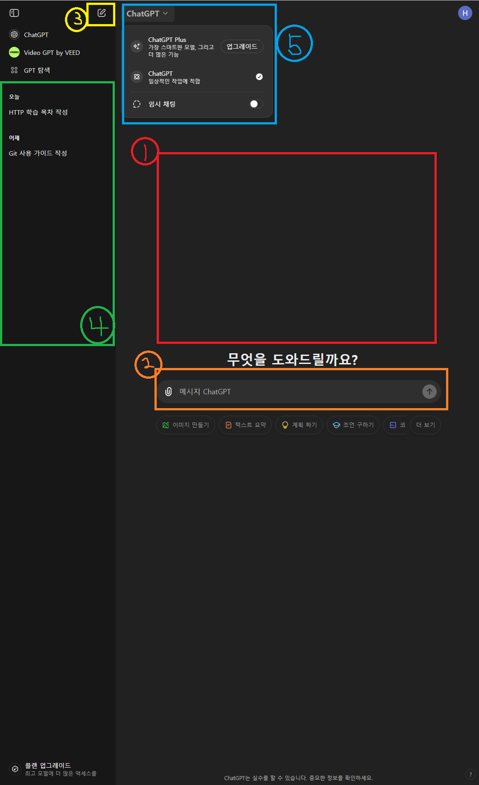

# 목차
1. [ChatGPT](#1-chatgpt)
2. [ChatGPT 시작하기](#2-chatgpt-시작하기)
3. [ChatGPT 기본 활용법](#3-chatgpt-기본-활용법)
4. [ChatGPT 실전 활용](#4-chatgpt-실전-활용)
5. [ChatGPT 고급 활용법](#5-chatgpt-고급-기능-마스터하기)

## 1. ChatGPT

### 1.1 ChatGPT란?

ChatGPT는 대화형 AI 모델로, GPT(Generative Pre-trained Transformer)라는 언어 모델을 기반으로 한다.

이 모델은 방대한 양의 텍스트 데이터를 학습하여 인간의 언어를 이해하고 생성한다.


#### 주요 특징
1. 맥락 이해 능력이 뛰어나다. : 이전 대화를 기억하고 이를 바탕으로 적절한 응답을 생성한다.
2. 다양한 작업을 수행한다. : 글쓰기, 코드 작성, 번역, 요약 등
3. 학습 능력이 뛰어나다.
4. 다국어를 지원한다.

### 1.2 ChatGPT와 다른 AI 도구들
1. 범용성 : 다른 aI 도구들이 특정 분야 및 작업에 특화되어 있는 반면, 매우 넓은 범위의 주제와 작업에 대응할 수 있다.
2. 대화능력 : 맥락을 이해하며 자연스럽고 연속된 대화를 이어갈 수 있다.
3. 학습 방식 : 사전 학습된 모델을 기반으로 적은 양의 추가 데이터로도 새로운 작업을 수행할 수 있다.
4. 창의성 : 새로운 아이디어를 생성하거나 창의적인 글쓰기를 할 수 있다.
5. 업데이트 : 주기적인 대규모 업데이트를 통해 성능을 크게 개선한다.

## 2. ChatGPT 시작하기

### 2.1 ChatGPT 서비스 가입하기

1. OpenAI 웹사이트 [https://chat.openai.com](https://chat.openai.com)에 접속한다.
2. Sign up 버튼을 클릭한다.
3. 원하는 방식으로 계정을 생성한다.
4. 이메일 인증, 개인정보 추가 입력 및 휴대폰 인증을 한다.

### 2.2 ChatGPT 인터페이스


1. 대화창 : 사용자와 ChatGPT간의 대화가 이루어지는 곳
2. 입력창 : 사용자의 질문 혹은 명령을 입력하는 곳
3. 새 대화 시작 : 새로운 대화를 시작하는 버튼
4. 대화 기록 : 이전 대화 기록이 표시되는 곳
5. 모델 선택 : ChatGPT 모델을 선택할 수 있는 곳

### 2.3 효과적인 프롬포트 작성하기
#### ChatGPT와 대화하는 기술
1. 명확하고 구체적으로 작성하기
    ```txt
        좋은 글 쓰는 법 x
        500단어 에세이를 위한 효과적인 서론 작성 방법 o
    ```
2. 맥락 제공하기 : 관련 배경정보, 원하는 결과물의 형식 등을 함께 제공하기
3. 단계별로 질문하기 : 복잡한 주제를 여러 단계로 나누어 질문하기
4. 예시 요청하기
5. 역할 부여하기 : ChatGPT에게 특정 역할을 부여하기
    ```txt
        당신은 경제 전문가입니다.
        당신은 복지 전문가입니다.
    ```
    등의 문구를 통해 해당 분야에 특화된 답변을 얻을 수 있다.
6. 출력 형식 지정하기 : 표, 나열 등
7. 답변 수정 요청하기 : 더 자세히 혹은 다른 관점으로의 답변수정을 요청할 수 있다.

## 3. ChatGPT 기본 활용법
### 3.1 정보 검색과 요약 <빠르고 정확한 답변 얻기>
1. 특화된 비교분석
    > 재생에너지와 화성연료의 장단점을 비교해줘
2. 구체적인 질문
    > 고전역학에 대해 알려줘 x

    > 뉴턴의 운동 3법칙을 예시와 함께 설명해줘 o

### 3.2 글쓰기 도우미 <에세이, 보고서, 블로그 포스트 작성>
1. 글의 구조 파악
    > 5단락 에서의 구조를 제안해줘
2. 아이디어 발상
    > 환경보호에 대한 블로그 포스트 주제 5개를 제안해줘
3. 문장 개선
    > 문장을 더 강력하게 만들어줘
4. 교정 및 편집
    > 문법과 맞춤법을 교정해줘

### 3.3 언어 학습과 번역 <ChatGPT로 어학 공부하기>
1. 번역 기능
    > "I'm so hungry"를 한글로 번역해줘
2. 문법 학습
    > 영어의 to부정사 용법을 예시와 함께 설명해줘
3. 실제 상황 시뮬레이션
    > 영어로 카페에서 주문하는 상황을 연습해 보자.
    > 카페 직원 역할을 해줘
4. 관용구 속담 학습
    > 영어의 날씨 관련 관용구를 예문, 한국어번역과 함께 알려줘

## 4. ChatGPT 실전 활용
### 4.1 학업에 활용 : 과제 해결 및 학습 보조
1. 개념 이해하기
    > 양자역학의 양자터널링현상을 중학생이 이해할 수 있게 비유를 통해 설명해줘
2. 문제 해결
    > 미분방정식의 기본 풀이법과 유도 과정을 예시를 통해 설명해줘
3. 에세이 구조화 및 아이디어 발굴
    > 기후변화가 생태계에 미치는 영향에 대한 에세이의 개요를 작성해 줘
4. 학습 계획 수립
    > 재수생인 내가 대학입시를 위한 6개월 간의 학습 계획 세워줘
5. 퀴즈 및 복습 자료 생성
    > 플라나리아 배양에 관한 10개의 퀴즈 문제를 난이도표시와 함께 만들어줘
### 4.2 직장에서의 활용 : 업무 효율성 높이기
1. 이메일 작성 지원
    > 고객에게 제품 배송 지연을 알리는 정중한 이메일 초안을 작성해줘
2. 보고서 작성 보조
    > 분기별 매출 보고서의 목차를 작성해줘
    
    > 분기별 매출 보고서의 분기 요약 부분의 템플릿을 만들어줘
3. 프레젠테이션 준비
    > 신제품 출시를 위한 10분 프레젠테이션의 개요를 만들어줘
4. 회의 준비 및 요약
    > 1시간동안 신매출 영업팀 회의를 위한 의제를 작성해줘
5. 데이터 분석 지원
    > 신제품 고객 만족도 설문조사 결과를 분석하는 방법과 활용하는 방법을 알려줘
### 4.3 창의적 프로젝트 : 아이디어 발상과 기획
1. 브레인스토밍
    > 환경보호 중 특히 해양 생태계 보호를 주제로 한 소셜미디어 캠페인 아이디어 10가지를 제안해줘
2. 스토리텔링
    > 중세 시대를 배경으로 한 판타지 소설의 주인공 캐릭터를 설정해줘
3. 디자인 컨셉 개발
    > 미니멀리즘을 주제로 한 로고 디자인의 주요 요소는 무엇인지 설명해줘

## 5. ChatGPT 고급 기능 마스터하기
### 5.1 코딩 도우미 : 학습과 디버깅
1. 프로그래밍 개념 설명
    > 객체 지향 프로그래밍의 핵심 원칙을 설명해 줘
2. 코드 생성
    > 파이썬으로 소수를 구하는 법을 에라토스테네세의 체를 이용한 방법으로 작성해줘
3. 코드 디버깅
    > 다음 파이썬 코드의 오류를 찾고 설명해줘 [코드]
4. 코드 최적화
    > 다음 파이썬 코드를 더 효율적으로 최적화해줘
5. 알고리즘 설명
    > 버블 정렬 알고리즘의 작동 원리를 단계별로 예시를 들어 설명해줘
### 5.2 데이터 분석 : ChatGPT로 인사이트 도출하기
1. 데이터 해석 지원
    > TMDB 영화 데이터에서 어떤 데이터를 확인할 수 있는지 알려줘
2. 통계 분석 방법 제안
    > 이 데이터셋에 어떤 통꼐 분석 방법이 적합한지 알려줘
3. 시각화 아이디어
    > 이 데이터를 효과적으로 시각화하는 방법을 알려줘
4. 가설 생성
    > 이 데이터에 대해 어떤 가설을 세울 수 있는지 알려줘
### 5.3 AI 작문
