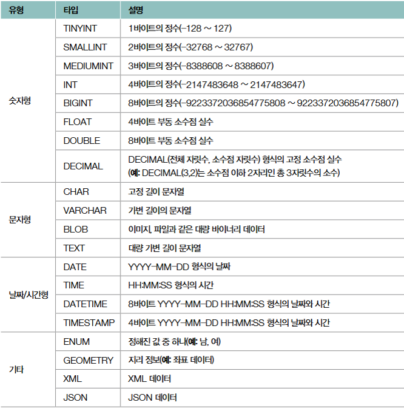
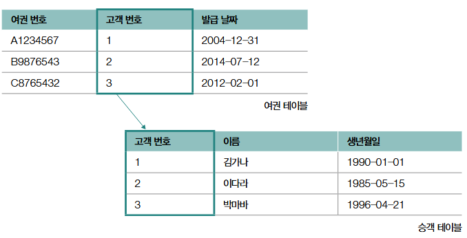
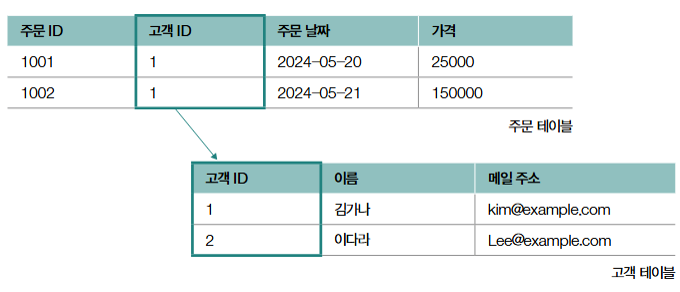
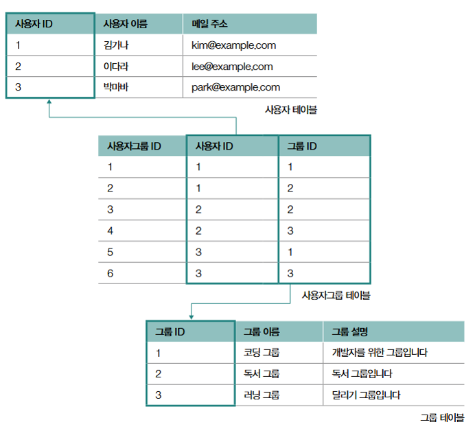

# DB02 - RDBMS

## 1. 테이블의 구성 - 필드와 레코드

    필드 타입 : 필드로 사용 가능한 데이터 유형
- 필드 타입의 종류

    키 : 테이블 내의 특정 레코드를 식별할 수 있는 필드의 집합
        1. 후보 키 : 테이블의 한 레코드를 식별하기 위한 필드의 최소 집합 - 유일성과 최소성을 모두 만족하는 키
        2. 복합 키 : 두 필드 이상으로 구성된 후보 키
        3. 슈퍼 키 : 레코르를 식별하기 위한 필드의 집합 - 유일성은 만족하나 최소성은 만족하지 않는 키
        4. 기본 키 : 한 레코드를 식별하도록 선정되어 테이블당 하나만 존재할 수 있는 키 -> Not NULL
        5. 외래 키 : 다른 테이블의 기본 키를 참조하는 필드
        6. 대체 키 : 기본 키가 아닌 후보 키

## 2. 테이블의 관계

### 1. 일대일 대응 관계
하나의 레코드가 다른 테이블의 레코드 하나에만 대응되는 경우

이 처럼 한 사람당 오직 하나의 여권만 가질 수 있는 관계

### 2. 일대다 대응 관계
하나의 레코드가 다른 테이블의 여러 레코드와 대응될 수 있는 경우

이처럼 한 고객이 여러 주문을 할 수 있는 경우

### 3. 다대다 대응 관계
한 테이블의 여러 레코드와 다른 테이블의 여러 레코드와 대응되는 경우

이처럼 하나의 사용자가 여러 그룹에 가입할 수 있고, 한 그룹에도 여러 사용자가 들어올 수 있는 경우

## 3. 무결성 제약 조건
무결성 : 일관되며 유효한 데이터의 상태
 
무결성 제약 조건 : 일관성과 유효성을 유지하기 위해 마땅히 지켜야 하는 조건

### 1. 도메인 제약 조건
테이블이 가질 수 있는 필드 타입과 범위에 대한 규칙

### 2. 키 제약 조건
레코드를 고유하게 식별할 수 있는 키, 중복값이 존재해서는 안되는 제약 조건

### 3. 엔티티 무결성 제약 조건
기본 키로 지정한 필드는 고유한 값이어야 하며, NULL이 되어서는 안되는 조건

### 4. 참조 무결성 제약 조건
외래 키를 통해 다른 테이블을 참조할 때, 참조하는 테이블의 기본 키와 같은 값을 갖거나 NULL값을 가져야 한다는 규칙 ( 외래 키 제약 조건 이라고도 부름 )
