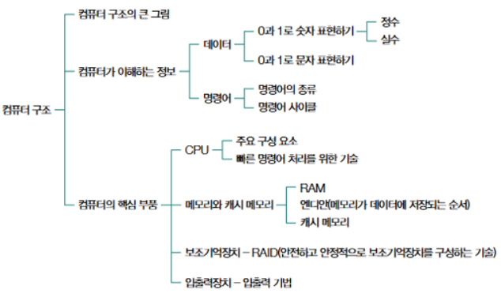

# Hardware 01 - 컴퓨터 구조

## 1. 컴퓨터가 이해하는 정보

컴퓨터는 사람이 이해하는 방식과는 다르게 정보를 처리한다.  
컴퓨터는 모든 데이터를 **이진수**로 변환하여 처리한다.  
이진수는 0과 1로 이루어진 수로, 전기 신호의 ON(1)과 OFF(0) 상태를 나타내는 방법이다.  
따라서, 컴퓨터는 모든 정보를 이진수로 변환하고, 연산과 저장을 이진수 형태로 수행한다.  

이진수는 **비트**(bit) 단위로 표현되며, 여러 비트들이 모여 **바이트**(byte)가 된다.  
1 바이트는 8 비트로 구성되며, 컴퓨터는 이 바이트를 단위로 데이터를 다룬다.  
예를 들어, 1 바이트는 256가지의 서로 다른 값을 표현할 수 있다.  
컴퓨터는 텍스트, 이미지, 비디오 등 다양한 정보를 모두 이진수로 바꿔 처리한다.  

## 2. 컴퓨터의 핵심 부품

컴퓨터의 핵심 부품들은 데이터를 처리하고 저장하는 중요한 역할을 한다.  
각각의 부품들은 서로 협력하여 컴퓨터가 다양한 작업을 수행할 수 있도록 한다.

### 1. CPU (Central Processing Unit)

**CPU**는 컴퓨터의 두뇌 역할을 하는 핵심 부품으로, 주로 **연산**과 **제어**를 담당한다.  
CPU는 명령어를 처리하고, 메모리에서 데이터를 가져와서 계산하거나 명령을 수행한다.  
CPU 내부에는 여러 개의 **ALU**(Arithmetic Logic Unit, 산술논리유닛)와 **CU**(Control Unit, 제어유닛)가 포함되어 있다.  
- **ALU**: 산술 및 논리 연산을 수행하는 부품으로, 덧셈, 뺄셈, AND, OR 등의 연산을 처리한다.
- **CU**: CPU 내에서 명령어를 해석하고, ALU와 메모리 간의 데이터 흐름을 제어하는 역할을 한다.

CPU의 성능은 주로 **클럭 속도**(GHz)와 **코어 수**에 의해 결정된다.  
클럭 속도는 초당 수행할 수 있는 명령어의 수를 의미하며, 코어 수는 동시에 여러 작업을 처리할 수 있는 능력을 의미한다.

### 2. 메모리(주기억장치)

**메모리**는 CPU가 빠르게 접근할 수 있도록 데이터를 임시로 저장하는 공간이다.  
컴퓨터의 메모리는 크게 **주기억장치**(RAM)와 **보조기억장치**(HDD, SSD 등)로 나뉜다.

- **RAM**(Random Access Memory): 데이터를 임시로 저장하는 메모리로, 휘발성이다.  
  컴퓨터가 작동하는 동안만 데이터를 저장하며, 전원이 끊어지면 저장된 데이터는 사라진다.  
  빠른 속도를 자랑하지만 용량은 상대적으로 작은 편이다.
  
- **ROM**(Read-Only Memory): 읽기 전용 메모리로, 프로그램을 영구적으로 저장하는 데 사용된다.  
  컴퓨터가 부팅될 때 필요한 기본적인 프로그램을 저장하고 있으며, 주로 비휘발성이다.

### 3. 캐시 메모리

**캐시 메모리**는 CPU와 주기억장치 사이에서 데이터를 빠르게 주고받을 수 있도록 돕는 **고속 메모리**다.  
CPU는 자주 사용하는 데이터를 캐시 메모리에 저장하여, 메인 메모리(RAM)보다 훨씬 빠르게 접근할 수 있도록 한다.  

캐시 메모리는 CPU 내부에 위치하며, **L1 캐시**, **L2 캐시**, **L3 캐시** 등의 레벨로 구분된다.
- **L1 캐시**: 가장 빠르지만 용량이 작은 캐시로, CPU 내부에 직접 포함되어 있다.
- **L2 캐시**: L1 캐시보다 용량이 크고, 속도는 상대적으로 느리다.
- **L3 캐시**: 여러 개의 CPU 코어가 공유하는 캐시로, L2 캐시보다 큰 용량을 가지만 속도는 더 느리다.

캐시 메모리는 CPU가 처리 속도를 높이는 데 중요한 역할을 한다.  
CPU가 자주 접근하는 데이터를 미리 캐시에 저장하여, 속도 저하를 최소화할 수 있다.

### 4. 보조기억장치

**보조기억장치**는 데이터와 프로그램을 영구적으로 저장하는 장치로, 컴퓨터의 저장 공간을 제공한다.  
보조기억장치는 **비휘발성**이며, 전원이 꺼져도 데이터가 유지된다.  
대표적인 보조기억장치에는 **하드디스크 드라이브**(HDD)와 **솔리드 스테이트 드라이브**(SSD)가 있다.

- **HDD**: 자기 디스크를 이용하여 데이터를 저장하는 장치로, 비교적 저렴하고 대용량을 제공하지만 속도는 SSD보다 느리다.
- **SSD**: 플래시 메모리 기반의 저장장치로, 빠른 속도와 내구성, 적은 소음 등에서 HDD보다 우수하다. 가격은 상대적으로 비싸지만, 성능 면에서는 뛰어난 장치이다.

보조기억장치는 데이터를 장기적으로 저장하는 데 사용되며, 프로그램, 운영체제, 파일 등을 저장하는 데 필요하다.

### 5. 입출력장치

**입출력장치**(I/O Devices)는 컴퓨터와 외부 환경 간의 데이터 전송을 담당하는 장치들이다.  
입력 장치는 사용자나 외부 시스템에서 데이터를 컴퓨터로 전달하며, 출력 장치는 컴퓨터가 처리한 데이터를 사용자나 외부 시스템에 전달한다.  

- **입력 장치**: 키보드, 마우스, 스캐너, 마이크 등 사용자가 데이터를 입력하는 장치들.
- **출력 장치**: 모니터, 프린터, 스피커 등 컴퓨터의 처리 결과를 사용자에게 출력하는 장치들.

입출력장치는 컴퓨터와 사용자 간의 상호작용을 가능하게 하며, 다양한 형태의 데이터 전달을 지원한다.  
각 장치는 컴퓨터 내부와의 연결을 통해 데이터를 전송하고, 사용자는 이를 통해 정보를 입력하고 결과를 출력받는다.

### 6. 저장장치의 계층 구조

컴퓨터의 저장장치는 **계층적**으로 구성되어 있으며, 각 저장장치는 **속도**와 **용량**에서 상호 보완적인 역할을 한다.  
저장장치 계층 구조는 주로 **속도**와 **가격**에 따라 구분되며, 빠른 장치는 용량이 적고, 느린 장치는 용량이 크다.

- **레지스터**: CPU 내에 있는 가장 빠른 저장 장치로, 계산 중인 데이터나 명령어를 임시로 저장한다.
- **캐시 메모리**: CPU와 메모리 사이에서 데이터를 빠르게 주고받을 수 있도록 돕는 저장 장치.
- **주기억장치 (RAM)**: 빠르지만 휘발성인 메모리로, 현재 실행 중인 프로그램과 데이터를 저장.
- **보조기억장치**(HDD, SSD): 데이터나 파일을 장기적으로 저장하는 대용량 저장장치.
  
이 계층 구조는 성능과 비용을 균형 있게 고려하여 설계된다.  
컴퓨터는 이 계층 구조를 통해 데이터를 빠르고 효율적으로 저장하고 접근한다.

## 3. 컴퓨터 구조

