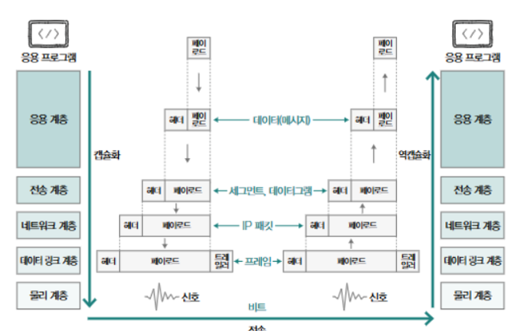
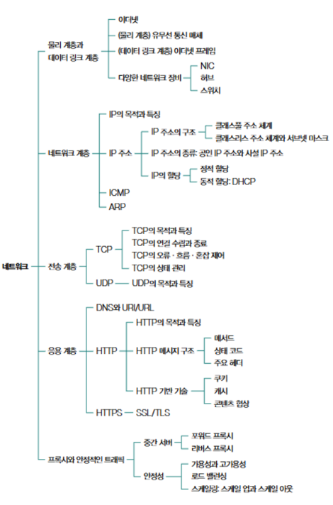

# 네트워크 (Network)

**네트워크** : 여러 대의 장치가 그물처럼 연결되어 정보를 주고받는 통신망

## 1. 네트워크 개요

### 1-1. 네트워크의 기본 구조

- 네트워크의 형태 : 노드와 간선으로 이루어진 **그래프**의 형태  
> 노드와 노드 사이의 연결 구조를 **네트워크 토폴로지** 라고 한다.
>
> 이 노드의 배치 방식에 따라 망형, 트리형, 링형, 성형, 선형 등으로 나눈다.
>
> 이때, 네트워크의 가장자리에 위치하면서 네트워크를 통해 주고받는 정보를 최초로 송신, 최종적으로 수신하는 노드를 **호스트**라고 한다.

**요청**을 보내는 **클라이언트**와 **응답**을 보내는 **서버**간에 정보를 주고 받는다.

### 1-2. LAN과 WAN
LAN(Local Area Network) : 근거리 네트워크 -> 공유기를 기준으로 구축된 네트워크
WAN(Wide Area Network) : 원거리 네트워크 -> 보통 인터넷 서비스 업체에서 구축 및 관리

### 1-3. 패킷 교환 네트워크
데이터를 **패킷**이라는 단위로 쪼개어 송수신하는 방식  
하나의 패킷은 페이로드와 헤더로 구성되어 있고, 때때로 트레일러라는 정보가 포함되어 있다.

```Markdown
페이로드 : 패킷에서 송수신하고자 하는 데이터  
헤더, 트페일러 : 부가 정보
```

### 1-4. 주소의 개념과 전송

**주소** : 패킷의 헤더에 명시되는 정보(대표적으로 IP주소, MAC주소)  

#### 메시지를 주고받는 전송 방식
1. 유니캐스트 : 송,수신자가 일대일로 메시지를 주고받는 전송 방식  
2. 브로드캐스트 : 네트워크상의 모든 호스트에게 메시지를 전송하는 전송 방식
    > 브로드캐스트 도메인 : 브로드캐스트가 전송되는 범위
3. 멀티캐스트 : 네트위크상의 특정 그룹에 속한 호스트에게만 전송하는 전송 방식
4. 애니캐스트 : 네트위크상의 특정 그룹에 속한 호스트중에서 가장 가까운 호스트에게 전송하는 전송 방식

### 1-5. 패킷의 송수신

#### 프로토콜

**프로토콜**은 네트워크에서 통신을 주곱다는 노드 간의 합의된 규칙이나 방법을 의미한다.  
같은 프로토콜을 선택하여 통신하여야만 서로간의 전달되는 정보를 이해할 수 있다.  

**프로토콜의 종류**눈 HTTP, HTTPS, IPFS, 등으로 다양하다.  
이 다양한 프로토콜은 각자의 목적과 특징이 다르다.  

예를 들어 IP는 네트워크 간의 **주소를 지정**하는 목적,  
ARP는 **IP 주소와 MAC주소를 대응시키는 목적,  
HTTPS는 보안상 HTTP에 비해 안전한 특징,  
TCP는 UDP에 비해 신뢰성이 높다는 특징등이 있다.  

> 따라서, 프로토콜에 대한 학습에는 반드시 목적과 특징에 대한 집중이 필요하다.


## 2. 모델01 - OSI모델

**OSI**모델은 국제 표준화 기구에서 만든 네트워크 참조 모델로, 통신 단계를 7계층(물리 계층, 데이터 링크 계층, 네트워크 계층, 전송 계층, 세션 계층, 표현 계층, 응용 계층)으로 나누어 구성한다.  

### 2-1. 물리 계층

**물리 계층**은 가장 최하위 계층으로서, 비트 신호를 주고받는 계층이다.  
컴퓨터가 이해하는 0과 1로 구성된 정보를 유무선 통신 매체를 통해 **운반**하는 계층이다.

### 2-2. 데이터 링크 계층
**데이터 링크 계층**은 같은 LAN에 속한 호스트끼리 올바르게 정보를 주고받기 위한 계층이다.  
이를 위해 네트워크에 속한 호스트를 식별할 수 있는 주소(MAC주소)를 사용하고, 정보의 오류를 확인한다.  

### 2-3. 네트워크 계층
**네트워크 계층**은 네트워크 간 통신을 가능하게 하는 계층이다.  
데이터 링크 계층의 LAN끼리의 통신에 비해, LAN을 넘어 다른 네트워크와 통신을 주고받기 위해 필요하며, IP주소를 사용한다.

### 2-4. 전송 계층
**전송 계층**은 패킷의 유실, 순서바뀜을 대비해 신뢰성 있는 전송을 가능하게 하는 계층이다.  
주요 프로토콜에는 TCP와 UDP가 있다.

### 2-5. 세션 계층
**세션 계층**은 세션(응용 프로그램 간의 연결 상태)을 관리하기ㅏ 위한 계층이다.

### 2-6. 표현 계층
**표현 계층**은 번역기와 같은 역할로써, 인코딩과 압축, 암호화 등의 작업을 수행하며, 응용 계층에 포함시키는 경우가 많다.

### 2-7. 응용 계층
**응용 계층은 사용자와 가장 밀접하게 닿아있어 네트워크 서비스를 제공하는 계층으로서, 중요한 프로토콜(HTTP, HTTPS, DNS)이 다수 포함되어 있다.

## 3. 모델02 - TCP/IP모델

**TCP/IP**모델은 네트워크 엑세스 계층, 인터넷 계층, 전송 계층, 응용 계층으로 구성되어 있다.  
OSI모델이 주로 네트워크의 이론적 기술을 목적으로 사용하는 반면, TCP/IP모델은 구현과 프로토콜에 중점을 둔 네트워크 모델이다.

### 3-1. 네트워크 엑세스 계층
**네트워크 엑세스 계층(링크 계층, 네트워크 인터페이스 계층)**이란 OSI의 데이터 링크 계층과 유사하다.  
OSI모델의 물리 계층이 포함된다는 견해와 TCP/IP모델에는 물리 계층의 개념이 없다고 보는 견해가 있다.

### 3-2. 인터넷 계층
**인터넷 계층**은 OSI 모델의 네트워크 계층과 유사하다.

### 3-3. 전송 계층
**전송 계층**은 OSI모델의 전송 계층이다.

### 3-4. 응용 계층
**응용 계층**은 OSI모델의 세션 계층, 표현 계층, 으용 계층을 포함한 개념이다.

## 4. 캡슐화와 역캡슐화

> **상기**
    - 패킷을 송신하는 쪽에서는 상위 계층에서 하위 계층으로 정보를 보내고, 수신하는 쪽에서는 하위 계층에서 상위 계층으로 정보를 받아들인다.
    - 네트워크 계층 구조를 이용하여 프로토콜을 계층별로 구성할 수 있다.
    - 하나의 패킷은 헤더와 페이로드를 포함하며, 프로토콜의 목적과 특성에 따라 헤더의 내용이 달라질 수 있다.

**캡슐화** : 송신 과정에서 헤더를 추가해 나가는 과정
**역캡슐화** : 수신과정에서 캡수화된 헤더를 각 계층에서 확인 후 제거하는 과정

#### 네트워크 계층 구조상 캡슐화와 역캡슐화 과정



## 5. 요약
#### 네트워크 지도
