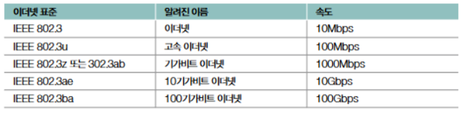

# Network 02 - 물리 계층과 데이터 링크 계층

## 01. 이더넷

**이더넷**이란 통신 매체를 통해 신호를 송수신하는 방법, 데이터 링크 계층에서 주고받는 데이터 형식등이 정의된 기술을 말한다.  
현재 대부분의 LAN은 이더넷을 기반으로 구현되어 있다.

### 이더넷 표준

이더넷은 IEEE 802.3이라는 이름으로 국제 표준화된 기술이다.
IEEE 802.3은 '이더넷과 관련된 다양한 표준들의 모음'이라고 할 수 있고, 뒤의 알파벳을 통해 버전을 나타낸다.

이더넷의 종류를 외울 필요는 없다.  
밑의 2가지만 기억하면 된다.
- 오늘날의 LAN 대부분이 이더넷 표준을 따르기 때문에 대다수의 LAN 장비들이 특정 이더넷 표준을 따른다. 
- 이더넷 표준이 달라지면 통신 매체의 종류를 비롯한 신호 송수신 방법, 나아가 최대 지원 속도가 달라질 수 있다.

### 이더넷 프레임

**이더넷 프레임**이란 이더넷 기반의 네트워크에서 주고받는 프레임을 말한다.  
오늘날 주로 사용되는 이더넷 프레임은 Ethernet II 프레임이라고도 부른다.  
프레임의 구성요소에는 프리앰블, 송수신지 MAC주소, 타입/길이, 데이터, FCS 등이 있다:

#### 1. 프리앰블  
**프리앰블**은 송수신지 동기화를 위해 사용되는 64비트 크기의 정보이다.  
데이터가 전송되기 전에 송신기와 수신기가 서로 동기화하도록 돕는다.

#### 2. 송수신지 MAC 주소  
MAC 주소는 프레임에서 매우 중요한 정보이다.  
송신지와 수신지를 특정하는 MAC 주소가 명시되며 콜론으로 구분된 12자리 16진수로 구성되어 있다.  
예시: '00:1A:2B:3C:4D:5E'

#### 3. 타입 / 길이  
이 필드는 데이터의 길이 또는 데이터 타입을 나타낸다.  
- 값이 1500 이하인 경우: 프레임의 크기를 나타냄
- 값이 1536 이상인 경우: 상위 프로토콜 타입을 나타냄 (예: IPv4는 `0x0800`)

#### 4. 데이터
**데이터 필드**에는 페이로드가 포함된다.   
최대 크기는 1500바이트로 제한되며, 필요한 경우 패딩 데이터가 추가될 수 있다. 

#### 5. FCS (Frame Check Sequence)
FCS는 프레임의 트레일러 필드로, 오류 검출을 위해 사용된다.   
CRC(순환 중복 검사) 값이 저장되어 있어, 수신 측에서 프레임의 무결성을 확인할 수 있다.

---

## 02. 유무선 통신 매체

### 1. 유선 매체 - 트위스티드 페어 케이블
트위스티드 페어 케이블은 두 개의 절연된 구리선을 꼬아서 만든 유선 매체이다.    
전송 간섭과 외부 노이즈를 줄이기 위해 꼬아 놓은 구조를 가지고 있다.    
주로 Ethernet에서 사용되며, 카테고리에 따라 최대 전송 속도가 다르다.    
- **Cat5e**: 최대 1Gbps
- **Cat6**: 최대 10Gbps  

### 2. 무선 매체 - 전파와 WIFI
무선 통신 매체는 전파를 이용해 데이터를 전송한다.    
Wi-Fi는 IEEE 802.11 표준을 기반으로 하며, 주파수 대역(2.4GHz 또는 5GHz)에 따라 전송 속도와 범위가 달라진다.    
- **2.4GHz**: 넓은 범위, 낮은 속도  
- **5GHz**: 좁은 범위, 높은 속도  

---

## 03. 네트워크 인터페이스: NIC
**NIC(Network Interface Card)**는 컴퓨터와 네트워크를 연결하는 물리적 인터페이스이다.  
NIC는 데이터 링크 계층과 물리 계층 모두에 해당하며, 다음과 같은 주요 기능을 한다:
- MAC 주소 제공
- 데이터 프레임 송수신
- 네트워크 프로토콜 처리

---

## 04. 허브와 스위치

### 1. 물리 계층의 허브

**허브**는 네트워크에서 데이터를 단순히 재전송하는 장치로, 물리 계층에 속한다.  
허브는 수신된 데이터를 모든 포트로 전송하므로, 네트워크 트래픽이 많아질수록 충돌이 발생할 가능성이 높다.

### 2. 데이터 링크 계층의 스위치

**스위치**는 데이터 링크 계층에서 동작하며, MAC 주소를 기반으로 데이터를 전달한다.  
스위치는 허브와 달리 데이터를 특정 포트로만 전송하므로, 네트워크 효율성이 높아진다.  
또한 충돌 도메인을 분리하여 충돌 문제를 줄일 수 있다.