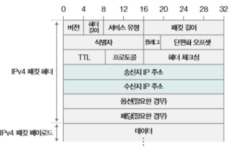

# network 03 - 네트워크 계층과 전송 계층

## 1. 네트워크 계층 - IP

### 1. IP의 목적과 특징

IP의 목적 : **주소지정과 단편화**  

**주소지정** : 네트워크 간의 통신 과정에서 호스트를 특정하는 것  

**단편화** : 데이터를 여러 IP패킷으로 올바르게 쪼개어 보내는 것  

IP의 특징 : **신뢰할 수 없는 통신**, **비연결형 통신**

#### 1. 주소 지정과 단편화
주소 지정은 IP주소를 통해 이루어지며, 이는 IP 패킷 해더를 통해 알 수 있다.  

| 참고로, 오늘날의 IP는 IPv4와 IPv6의 2가지 종류가 있고, 둘 중 IPv4가 더 많이 사용된다.  

송신지 IP 주소와 수신지 IP 주소 필드에는 송수신지를 식별할 수 있는 IP 주소가 명시된다.  
하나의 IP주소는 총 32비트의 크기로 구성되고, 0~255 범위의 10진수 4개로 표기된다.  
이 때, 점으로 구분된 하나의 10진수를 옥텟이라고 한다.  

| 라우터 : IP 주소를 바탕으로 목적지까지 IP 패킷을 전달하는 네트워크 장비  
| 라우팅 : 라우터가 IP 패킷을 전달할 최적의 경로를 결정하고 해당 경로로 패킷을 보내는 과정  
| MTU(Maximum Transmission Unit) : IP 패킷의 최소 전송 단위(기본적으로 1500바이트)  

#### 2. IP 패킷 해더
    1. 식별자 : 특정 패킷이 어떤 데이터에서 쪼개진 패킷인지를 식별하기 위한 필드  
    2. 단편화 오프셋 : 특정 패킷이 초기 데이터에서 얼마나 떨어져 있는지가 명시된 필드  

#### 3. 신뢰할 수 없는 통신과 비연결형 통신
    1. 신뢰할 수 없는 통신 : 패킷이 수신지까지 제대로 전송되었다고 보장하지 않는 프로토콜, 즉 패킷이 유실되거나 제대로 전송되지 않아도 조치를 취하지 않는다.  
    2. 비연결형 프로토콜 : 패킷을 주고받기 전에 사전 연결 과정을 거치지 않는 것  

---

### 2. IP 주소의 구조

#### 1. IP 주소의 구성
IP 주소는 크게 네트워크 주소와 호스트 주소로 이루어져 있다.

**네트워크 주소**는 네트워크 ID, 네트워크 식별자 등으로 불리며 호스트가 속한 네트워크를 특정하기 위해 사용된다.  
**호스트 주소**는 호스트 IP, 호스트 식별자 등으로 불리며, 네트워크에 속한 호스트를 특정하기 위해 사용된다.  

| 예시1) 111.222.33.44 - 네트워크 주소(111.222) + 호스트 주소(33.44)  
| 예시2) 111.22.33.44 - 네트워크 주소(11) + 호스트 주소(22.33.44)

#### 2. 클래스풀 주소 체계

**클래스**란 네트워크의 크기에 따라 유형별로 IP 주소를 분류하는 기준으로 A, B, C, D, E의 다섯가지 종류가 있다.  
D, E클래스는 멀티캐스트를 위한 클래스로서, 특수 목적을 위해 예약된 클래스이기 때문에, 네트워크의 크기별로 IP 주소를 분류하는 데에 실질적으로 사용되는 클래스는 A, B, C이다.  
이러한 클래스를 바탕으로 IP 주소를 관리하는 주소 체계를 **클래스풀 주소 체계**라고 한다.  

| A 클래스 : 0.0.0.0 ~ 127.255.255.255 사이의 IP 주소를 가지며, 크기가 8비트 이다.  
| B 클래스 : 128.0.0.0 ~ 191.255.255.255 사이의 IP 주소를 가지며, 크기가 16비트 이다.  
| C 클래스 : 192.0.0.0 ~ 223.255.255.255 사이의 IP 주소를 가지며, 크기가 24비트 이다.  

#### 3. 클래스리스 주소 체계와 서브넷 마스크  

클래스풀 주소 체계에서는 클래스 별 네트워크가 고정되어 있다.  
이렇게 크기가 고정되어 있는 경우에는 지정 크기 외의 다른 크기의 네트워크를 구성할 수 없기 때문에 IP 주소가 낭비될 수 있다는 한계가 존재한다.  
따라서, 더 정교하고 유동적으로 네트워크 영역을 나누는 개념이 **클래스리스 주소 체계**이다.

| **서브넷 마스크** : IP 주소상에서 네트워크 주소를 1로 표기하고, 호스트 주소를 0으로 표기한 비트열  
| **서브네트워크(서브넷)** : IP 주소에서 네트워크 주소로 구분할 수 있는 네트워크의 부분집합  
| **서브네팅** : 이러한 서브넷 마스크를 사용하기 위해 원하는 크기로 클래서를 잘게 쪼개어 사용하는 것  

**예시**  
- 기존의 클래스풀 체계의 기본 서브넷 마스크
    | A 클래스 : 255.0.0.0(11111111.00000000.00000000.00000000)
    | B 클래스 : 255.255.0.0(11111111.11111111.00000000.00000000)
    | C 클래스 : 255.255.255.0(11111111.11111111.11111111.00000000)

- IP 주소 : 100.101.102.103
    이 IP 주소와 서브넷 마스크의 AND 연산을 수행하면 네트워크 주소를 알아낼 수 있다.
    (100.101.102.103) & (255.255.255.0) = 100.101.102.0

---

### 3. 공인 IP 주소와 사설 IP 주소  
**공인 IP 주소**란 전 세계에서 고유한 IP 주소를 말한다.  
**사설 IP 주소**란 사설 네트워크에서 사용하기 위한 IP 주소를 말한다.  

| 사설 IP 주소로서 사용하는 주소  
| 10.0.0.0/8, 176.16.0.0/12, 192.168.0.0/16

---

### 4. IP 주소의 할당

#### 1. 정적 할당  
직접 수작업으로 IP 주소를 부여하는 방식  
정적 IP 주소 부여를 위한 값 : IP 주소, 서브넷 마스크, 게이트웨이 주소, DNS 주소   
| 게이트웨이 : 서로 다른 네트워크를 연결하는 하드웨어, 소프트웨어적 수단(보통 공유기의 주소)  
| DNS 주소 : 호스트가 도메인 네임을 토대로 IP 주소를 알아내기 위해 질의하는 서버의 주소  

#### 2. 동적할당 - DHCP  
프로토콜을 통해 자동으로 IP 주소를 부여하는 방식  
보통 DHCP 프로토콜을 많이 사용한다.  

---

### 5. IP 전송 특징의 보완 = ICMP
**ICMP**는 IP 패킷의 전송 과정에 대한 피드백 메시지를 얻기 위해 사용하는 프로토콜이다.  
**ICMP 메시지**는 크게 '전송 과정에서 발생한 오류 보고'와 '네트워크에 대한 진단 정보'로 유형을 나눌 수 있다.  

| 오류 보고
- 네트워크 도달 불가
- 호스트 도달 불가
- 프로토콜 도달 불가
- 포트 도달 불가
- 단편화 불가
- TTL 만료

| 네트워크 정보 제공
- Echo 요청
- Echo 응답

---
---

## 전송 계층 - TCP와 UDP

### 1. TCP와 UDP의 목적과 특징

전송 계층은 애플리케이션 계층에서 전달된 데이터를 송수신 간에 정확하고 효율적으로 전송하도록 설계된 계층이다.  
주요 프로토콜로는 **TCP**(Transmission Control Protocol)와 **UDP**(User Datagram Protocol)가 있다.

#### 1. 포트를 통한 프로세스 식별
전송 계층에서 가장 중요한 역할 중 하나는 **포트를 통한 프로세스 식별**이다.  
포트 번호는 각 프로세스를 고유하게 식별하며, 데이터 전송 과정에서 통신할 애플리케이션을 결정한다.

- **송신지 포트**: 데이터를 보내는 애플리케이션의 포트 번호
- **수신지 포트**: 데이터를 받을 애플리케이션의 포트 번호

포트 번호는 **0~65535** 사이의 값을 가지며, 주요 범위는 다음과 같다:
- **0~1023**: 잘 알려진 포트(예: HTTP 80, HTTPS 443, FTP 21 등)
- **1024~49151**: 등록된 포트(특정 애플리케이션용)
- **49152~65535**: 동적 포트 또는 임시 포트(클라이언트에서 사용)

#### 2. (비)신뢰성과 (비)연결형 보장
TCP와 UDP는 전송 방식과 신뢰성 측면에서 큰 차이를 가진다.

- **TCP (Transmission Control Protocol)**  
  TCP는 **연결형 프로토콜**로, 신뢰성 있는 데이터 전송을 보장한다.  
  데이터의 순서, 무결성, 손실 복구를 보장하기 위해 다음과 같은 기능을 제공한다:
  - **데이터 확인(Acknowledgment)**: 수신자가 데이터를 수신했음을 확인
  - **재전송**: 손실된 데이터는 재전송
  - **순서 재정렬**: 도착 순서가 뒤섞인 데이터를 올바르게 재배열
  - **흐름 제어**: 수신자가 처리 가능한 속도로 데이터 전송
  - **혼잡 제어**: 네트워크의 혼잡 상태를 감지해 전송 속도를 조절

- **UDP (User Datagram Protocol)**  
  UDP는 **비연결형 프로토콜**로, 데이터 전송 속도와 효율성을 중시한다.  
  신뢰성은 없지만 헤더가 작아 오버헤드가 적으며, 실시간 성능이 중요한 애플리케이션에 적합하다:
  - 오류 검출은 가능하지만 복구는 하지 않음
  - 데이터의 순서 보장 없음
  - 사전 연결 과정이 없으므로 전송 지연이 낮음

---

### 2. TCP의 연결부터 종료

TCP는 연결형 프로토콜로, 데이터 전송 전후에 연결 수립 및 종료 과정을 거친다.

#### 1. TCP의 연결 수립 (3-Way Handshake)
**3-Way Handshake**는 송수신자가 서로를 확인하고 연결을 설정하는 과정이다.

1. **SYN**: 클라이언트가 서버에 연결 요청을 보냄.
   - `SYN` 플래그가 설정된 TCP 세그먼트를 전송.
2. **SYN-ACK**: 서버가 요청을 수락하고 응답.
   - `SYN` 플래그와 `ACK` 플래그가 설정된 세그먼트를 전송.
3. **ACK**: 클라이언트가 응답을 확인.
   - `ACK` 플래그가 설정된 세그먼트를 전송.

이 과정이 완료되면 TCP 연결이 성립되고 데이터 전송이 시작된다.

#### 2. TCP의 오류, 흐름, 혼잡 제어
TCP는 데이터 전송의 신뢰성을 보장하기 위해 다양한 제어 메커니즘을 제공한다.

- **오류 제어**  
  TCP는 데이터 손상, 유실을 감지하고 복구한다:
  - **체크섬**: 데이터 손상을 검출
  - **재전송**: 손실된 세그먼트를 재전송
- **흐름 제어**  
  송신 속도를 수신자의 처리 속도에 맞추기 위해 Sliding Window를 사용한다:
  - 수신자는 처리 가능한 데이터 크기를 `윈도우 크기`로 송신자에게 알림.
  - 송신자는 윈도우 크기 범위 내에서만 데이터를 전송.
- **혼잡 제어**  
  네트워크 혼잡을 방지하기 위해 전송 속도를 동적으로 조절한다:
  - **Slow Start**: 네트워크 상태를 확인하며 전송 속도를 점진적으로 증가.
  - **Congestion Avoidance**: 혼잡을 감지하면 속도를 줄이고 회복.

#### 3. TCP의 종료 (4-Way Handshake)
TCP 연결 종료는 **4-Way Handshake**로 이루어진다:

1. 클라이언트가 **FIN** 플래그를 전송하며 연결 종료 요청.
2. 서버가 **ACK** 플래그를 전송하며 요청 수락.
3. 서버가 **FIN** 플래그를 전송하며 종료 요청.
4. 클라이언트가 **ACK** 플래그를 전송하며 종료 확인.

TCP 연결 종료 후, 클라이언트는 일정 시간 동안 **TIME_WAIT** 상태에 머물러 남은 패킷이 도착하는지 확인한다.

---

### 3. TCP의 상태 관리

TCP는 연결 수립, 데이터 전송, 종료 과정에서 다양한 상태를 거친다:

- **LISTEN**: 서버가 연결 요청 대기.
- **SYN_SENT**: 클라이언트가 SYN 요청을 보낸 상태.
- **SYN_RECEIVED**: 서버가 SYN 요청을 받고 응답을 대기 중.
- **ESTABLISHED**: 연결이 성립되어 데이터 전송 가능.
- **FIN_WAIT_1**: 클라이언트가 FIN 요청을 보낸 상태.
- **CLOSE_WAIT**: 서버가 FIN 요청을 받고 종료 대기.
- **LAST_ACK**: 서버가 마지막 ACK를 보낸 상태.
- **TIME_WAIT**: 클라이언트가 모든 패킷 전송 완료 후 대기.

---

### 4. UDP의 특징

UDP는 데이터그램 기반의 비연결형 프로토콜로 설계되었다.  
TCP보다 간단하지만 다음과 같은 특징이 있다:

- **헤더 구조**: UDP 헤더는 8바이트로, 다음과 같은 필드를 포함:
  1. 송신 포트
  2. 수신 포트
  3. 길이
  4. 체크섬
- **오류 검출**: 체크섬 필드로 손상된 데이터 검출 가능(복구는 하지 않음).
- **순서 보장 없음**: 데이터그램의 도착 순서를 보장하지 않음.
- **적용 분야**:
  - VoIP, 실시간 스트리밍
  - 온라인 게임
  - DNS, DHCP와 같은 경량 프로토콜
