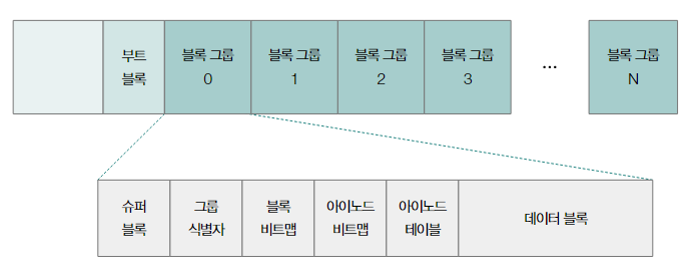

# 파일 시스템

보저기억장치의 정보를 파일 및 디렉터리의 형태로 저장하고 관리할 수 있도록 하는 운영체제 내부 프로그램

## 파일과 디렉터리
### 파일
    파일의 구성 
    파일의 이름, 파일을 실행하기 위한 정보, 속성(메타데이터, 파일과 관련한 부가 정보)

파일을 다루는 모든 작업은 운영체제에 의해 이루어진다. 응용 프로그램은 임의로 파일을 할당받아 조작하고 저장할 수 없고, 파일을 다루는 시스템 콜을 이용해야 한다.

    파일 디스크립터
    프로세스가 파일을 식별할 수 있는 정보
    open()의 반환값 및 write()의 인자가 된다.

### 디렉터리 (폴더)
관리 방식 : 트리 구조 디렉터리

루트 디렉터리와 서브 디렉터리로 구성되며, 슬래시(/)로 구분되는 경로를 사용하여 표시한다.

경로 : 디렉터리 정보를 활용해 파일 위치를 특정하는 정보

디렉터리 엔트리 : 디렉터리에 속한 요소의 관련 정보를 테이블의 형태로 표현하고, 테이블의 형태로 표현된 정보의 행 하나 하나
- 파일의 인덱스 번호, 파일 형식, 파일 이름 등등이 포함 된다.

### 파일 할당
운영체체는 파일과 디렉터리를 **블록(Block)** 이라는 단위로 읽고 쓴다.

파일 하나는 여러 블록으로 구성될 수 있으며, 블록의 일부에 다음 불록의 주소를 저장한다(연결 할당).

디렉터리 엔트리에는 파일의 첫 번째 블록 주소와, 파일을 이루는 블록 단위의 길이가 표시된다.

색인 할당 : 모든 블록의 주소를 색인 블록이라는 특별한 블록에 모아 관리하는 방식으로 할당하는 할당 기법

## 파일 시스템
포매팅 : 파일 시스템을 설정하여 어떤 방식으로 파일을 저장하고 관리할 것인지를 결정하고 새로운 데이터를 쓸 준비를 하는 작업

    운영체제별파일 시스템의 특성
    - 윈도우 : NTFS, ReFS(Resilient File System) 등
    - 리눅스 : EXT, EXT2, EXT3, EXT4, XFS, ZFS, 등 
    - 맥os : APFS 등

### 아이노드 기반 파일 시스템
파일은 각각의 아이노드를 가지고 있으며 아이노드에는 각각의 번호가 부여되어 있다.

다음은 대표적인 아이노드 기반 파일 시스템인 EXT4 파일 시스템이다.

블록 그룹의 구성

| 이름             | 설명                                                                 |
|------------------|----------------------------------------------------------------------|
| 슈퍼 블록        | 아이노드의 개수, 총 블록 개수, 블록 크기 등 전체적인 파일 시스템의 정보를 저장 |
| 그룹 식별자      | 블록 그룹에 대한 메타데이터를 저장                                      |
| 블록 비트맵      | 현재 블록 그룹 내에서 데이터가 어떻게 할당되었는지를 저장                 |
| 아이노드 비트맵  | 현재 블록 그룹 내에서 아이노드가 어떻게 할당되었는지를 저장               |
| 아이노드 테이블  | 각 파일의 아이노드 정보를 저장                                         |
| 데이터 블록      | 각 파일의 데이터를 저장                                                |

    아이노드는 파티션 내 특정 영역에 남아있다.  
    아이노드 기반 파일 시스템에서는 데이터 영역에 공간이 남아 있더라도, 아이노드 영역이 가득 차 있다면 새로운 파일을 생성할 수 없다.

#### 하드 링크와 심볼릭 링크
아이노드를 기반으로 하드 링크 파일과 심볼릭 링크 파일을 만들 수 있다.
- 하드 링크 : 원본 파일과 같은 아이노드를 공유하는 파일
    - 하드 링크는 같은 아이노드 번호를 갖는 파일을 생성하는 작업이므로 원본 파일과 데이터를 공유하며, 하드 링크 파일이 변경되면 원본 파일도 변경된다.
    - 원본 파일이 삭제되거나 이동되더라도 하드 링크 파일이 남아있다면 파일 데이터에 접근할 수 있다.
- 심볼릭 링크 : 원본 파일을 가리키는 파일
    - 파일 데이터를 공유하지 않고 원본 파일의 위치만을 저장하기 때문에 원본 파일이 삭제되거나 이동하는 경우에는 사용이 불가능 하다.

### 마운트

어떤 저장장치의 파일 시스템에서 다른 저장장치의 파일 시스템으로 접근할 수 있도록 파일 시스템을 편입시키는 작업
