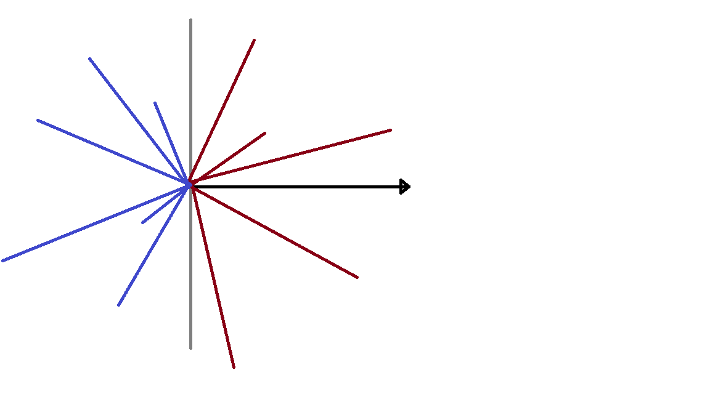

# **외적의 이해**

외적 (Cross Product) : 두 벡터의 곱을 의미하는 수학적 용어

벡터의 곱에 해당하는 외적이라는 개념은 선분교차 알고리즘을 이해하는 데에 필요하다.

외적은 두 벡터의 크기와 사잇각의 코사인값을 곱한 값으로 구해진다.

특히, 선분교차 알고리즘에서 중요한 값, 또는 나중에 개발을 하게 되는 경우에 중요한 값은 결국 코사인값이다.

코사인 값은 -90도에서 90도 사이에서만 양수이다. 즉 어떤 한 벡터가 바라보는 방향을 기준으로 왼쪽 오른쪽에 해당하는 부분 안쪽의 값만 양수가 나온다.

다음 그림에서 붉은 색의 벡터와 파란색의 벡터가 기준이 되는 검은 색의 벡터와의 외적을 구한다면 양수와 음수 라는 매우 중요한 차이점을 알 수 있다.



# **세 점의 방향 판단**

그렇다면 이 성질을 이용하여 세 점이 어떤 방향성을 이루고 있는지를 알아볼 수 있다.

두 벡터의 외적이 0보다 크다면, 기준 벡터를 x축 벡터로 가정했을 때, 180도 이내의 벡터인 즉, 반시계방향의 선분이 되는 것이고,

0보다 작다면 그 반대인 시계방향,

0이라면 직선의 형태를 띄게 된다.

# **선분교차 (CCW - Counterclockwise)**

외적을 이용한 선분교차를 판별하는 알고리즘

## 1\. 순서대로 이은 선분의 방향 판별

[백준 11758.CCW](https://www.acmicpc.net/problem/11758)

```python

import sys
input = sys.stdin.readline

# 외적
def ccw(x1, y1, x2, y2, x3, y3):
    return x1*y2 + x2*y3 + x3*y1 - x2*y1 - x3*y2 - x1*y3

x1, y1 = map(int, input().split())
x2, y2 = map(int, input().split())
x3, y3 = map(int, input().split())

# 0보다 크면 Counterclockwise(반시계방향)
# 0보다 작으면 clockwise(시계방향)
res = ccw(x1, y1, x2, y2, x3, y3)
if res > 0:
    print(1)
elif res < 0:
    print(-1)
else:
    print(0)
```

# **선분 교차**

또는 이 성질을 이용해서, 선분의 교차여부를 확인할 수 있다.

선분 AB와 선분 CD가 있다고 가정해보자.

1.  먼저, 선분 AB에서 점 C와 점 D를 각각 바라보았을 때, 두 값의 방향이 같다면, 즉 두 외적의 곱이 양수라면,
2.  즉, ABC의 CCW알고리즘 결과값과 ABD의 알고리즘 결과값의 곱이 양수라면 두 선분을 만날 가능성이 없다.
3.  두번째로, 둘다 0이 나온다면, 선분 AB와 선분 CD는 한 직선상에 있다고 할 수 있다.
4.  이 때는, 선분의 길이와 좌표를 비교하여 교차여부를 판별해주어야 한다.
5.  둘다 0이하이면서, 둘 다 0인 경우가 아니라면, 선분이 교차한다고 할 수 있다.

## 2\. 선분이 교차되는지를 판별하기

[백준 2162.선분 그룹](https://www.acmicpc.net/problem/2162)

```python

import sys
input = sys.stdin.readline

n = int(input())
arr = [[] for _ in range(2 * n)]
parent = [i for i in range(2 * n)]
dp = [1 for i in range(2 * n)]
cnt = [False for i in range(2 * n)]

def union_find(x):
    if x == parent[x]: return x
    parent[x] = union_find(parent[x])
    return parent[x]

def union_set(x, y):
    x, y = union_find(x), union_find(y)
    if x == y: return 1
    if x < y:
        x, y = y, x
    parent[x] = y
    dp[y] += dp[x]
    return False

# ccw
def ccw(a1, b1, a2, b2, a3, b3):
    return a1 * b2 + a2 * b3 + a3 * b1 - b1 * a2 - b2 * a3 - b3 * a1

# 선분 교차를 확인하는 함수
def check(a, b):
    l1 = ccw(a[0], a[1], a[2], a[3], b[0], b[1]) * ccw(a[0], a[1], a[2], a[3], b[2], b[3])
    l2 = ccw(b[0], b[1], b[2], b[3], a[0], a[1]) * ccw(b[0], b[1], b[2], b[3], a[2], a[3])
    # 한 선분에서 다른 선분의 두 점을 각각 바라보았을 때
    # 두 값의 방향이 다르면(ccw의 곱이 0이하이면) 교차할 가능성이 있음
    # 하지만 직선으로 이었을 때 교차하는 경우 일 수 있으므로
    # 양쪽 선분 모두에서 바라본 값을 계산해줘야 함
    if l1 <= 0 and l2 <= 0:
        # 이 때, 둘다 0이 나온다면 일직선에 있는 것이므로 
        # max와 min값을 비교하여 겹치는지 확인해줘야함
        if l1 == 0 and l2 == 0:
            d1 = max(a[0], a[2]) >= min(b[0], b[2]) and max(b[0], b[2]) >= min(a[0], a[2])
            d2 = max(a[1], a[3]) >= min(b[1], b[3]) and max(b[1], b[3]) >= min(a[1], a[3])
            if d1 and d2:
                return 1
            return 0
        else:
            return 1
    return 0

for i in range(n):
    x1, y1, x2, y2 = list(map(int, input().split()))
    arr[2 * i] = (x1, y1)
    arr[2 * i + 1] = (x2, y2)
    union_set(2 * i, 2 * i + 1)

    for j in range(i):
        a = (x1, y1, x2, y2)
        b = (arr[2 * j][0], arr[2 * j][1], arr[2 * j + 1][0], arr[2 * j + 1][1])
        if check(a, b):
            union_set(2 * i, 2 * j)

group = []
for i in range(2 * n):
    if cnt[i]: continue
    a = union_find(i)
    group.append(a)
    for j in range(2 * n):
        if a == union_find(j): cnt[j] = 1

res = 0
for i in group: res = max(res, dp[i])

print(len(group))
print(res // 2)
```

## 참고 문제 모음

-   [G4 : 2987. 사과나무](https://www.acmicpc.net/problem/2987)
-   [25308\. 방사형 그래프](https://www.acmicpc.net/problem/25308)
-   [1027\. 고층 건물](https://www.acmicpc.net/problem/1027)