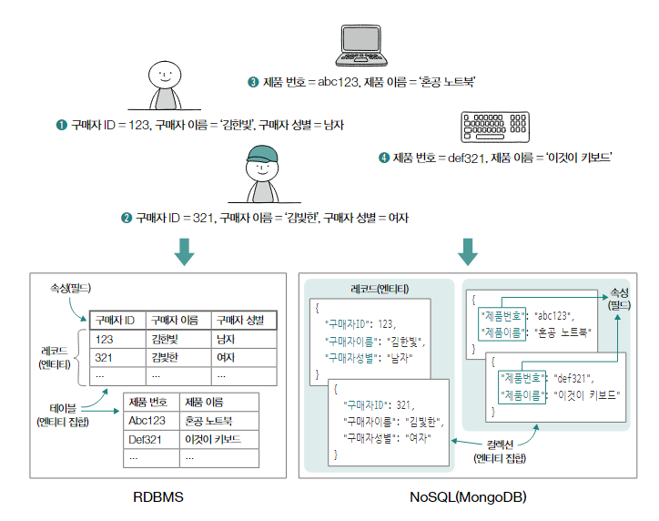
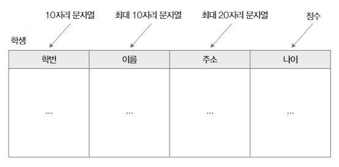
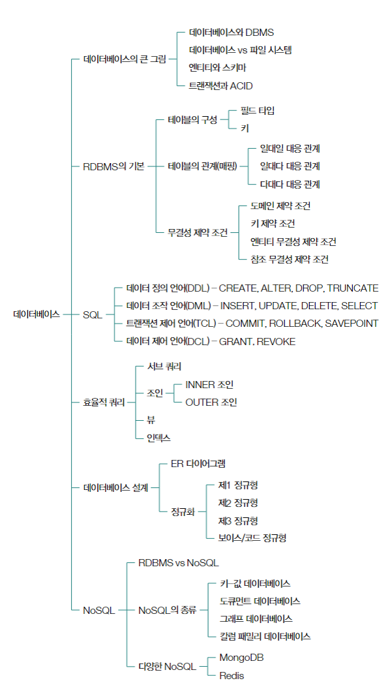

# 데이터베이스 01 - 데이터베이스 일반

## 데이터베이스와 DBMS

### 1. 데이터베이스(Database)
여러 원하는 기능을 동작시키기 위해 마땅히 저장해야 하는 정보의 집합 

    데이터베이스관리 시스템(DBMS : Database Management System)

    데이터베이스를 관리하기 위한 프로그램
    
    1. 관계형 데이터베이스 관리 시스템(RDBMS) : MySQL, MariaDB, PostgreSQL 등 이 있음.
    
    2. NoSQL 데이터베이스 관리 시스템(NoSQL DBMS)

### 2. 서버로서의 DBMS
    응용 프로그램이 DBMS를 이용하는 과정은 클라이언트-서버 간의 동작과 유사하다.
    
    주로 TCP 연결을 맺으며, 때론 인증이 필요하기도 하다.

    DBMS클라이언트는 DBMS에 쿼리를 보낸다.

    SQL : RDBMS에서 데이터를 조작하고 관리하기 위한 언어

## 파일 대신 데이터베이스를 이용하는 이유

### 1. 데이터 일관성 및 무결성의 제공

    프로그램은 보통 동시다발적으로 데이터베이스를 이용한다.
    이러한 경우에 레이스 컨디션이 발생할 여지가 높고, 데이터 일관성이 훼손되기 쉽다.

    파일에 명시덴 데이터에 결함이 없음을 일일이 검사하기 어렵다.
    즉, 데이터 무결성을 보장하기 어렵다.

### 2. 불필요한 중복 저장
    파일로 다량의 데이터를 관리할 경우, 불필요한 중복 저장이 발생하기 쉽다.
    이런 중복 저장은 큰 저장 공간 낭비로 이어질 수 있다.

### 3. 데이터 변경 시 연관 데이터 변경이 어려움
    예를 들어, 학과 명이 변경된 경우 모든 학과 학생의 이름을 변경해야 한다.

### 4. 정교한 검색의 어려움
    데이터 검색이 파일 내 문자열 검색에 국한되는 경우가 많다.
    '나이가 25살 이상'인 '컴퓨터과학과'인 '서울'거주자 이런 식의 정교한 검색이 어려움

### 5. 백업 및 복구의 어려움

## 데이터베이스의 저장 단위와 트랜잭션

### 1. 데이터베이스의 저장 단위
    엔티티(entity) : 독립적으로 존재할 수 있는 객체

    속성(attribute) : 엔티티의 특성

    엔티티 집합 : 같은 속성을 공유하는 개별 엔티티

#### 엔티티와 엔티티 집합을 표현하고 저장하는 방법

    릴레이션 : RDBMS에서 표현되는 이차원 테이블 형태의 엔티티 집합

    컬렉션 : NoSQL에서 사용되는 엔티티 집합

    레코드 : 데이터베이스에 저장된 대상 (기록이된 각각의 엔티티)

    필드 : 데이터베이스에 저장된 엔티티 속성

#### 스키마

    RDBMS와 NoSQL을 구분하는 주요 기준 중의 하나
    
    데이터베이스에 저장되는 레코드의 구조와 제약 조건을 정의한 것

    '데이터베이스의 틀'

스키마 : 이 테이블의 구조와 각 필드의 데이터 타입, 제약 조건 등이 정의된 틀

#### 트랜잭션과 ACID
    트랜잭션 : 데이터베이스와의 논리적 상호작용의 단위
    데이터베이스의 작업 성능을 나타낸다.

    ACID : Atomicity, Consistency, Isolation, Durability
    여러 사용자/프로그램이 데이터베이스를 동시다발적으로 사용하기 때문에, 안전한 트랜잭션을 보장하기 위한 4가지 성질

1. Atomicity(원자성)
- 하나의 트랜잭션 결과가 모두 성공하거나 모두 실패하는 성질
- 여러 개의 작업을 포함한 트랜잭션이 하나의 단위로 처리되는 것
- 일부 성공, 일부 실패가 없음
- 'All or Nothing'

2. Consistency(일관성)
- 트랜잭션 전후로 데이터베이스가 일관된 상태를 유지하는 성질
- 데이터베이스가 지켜야하는 일련의 규칙들을 지켜야 하는 상태
- 데이터의 제약 조건(문자열의 길이, Not NULL, 데이터 형식 등)

3. Isolation(격리성)
- 동시에 수행되는 여러 트랜잭션이 서로 간섭하지 않도록 보장하는 성질
- 레이스 컨디션을 방지하기 위한 성질
- 한 트랜잭션이 특정 데이터에 접근하여 조작 중인 경우, 다른 트랜잭션이 접근하지 못하게 함

4. Durability(지속성)
- 트랜잭션이 성공적으로 완료되었다면, 그 결과가 영구적으로 반영되는 성질
- 시스템 내부의 장애가 발생하더라도 완료된 트랜잭션의 결과가 손실되지 않도록 함

## 데이터베이스 지도

