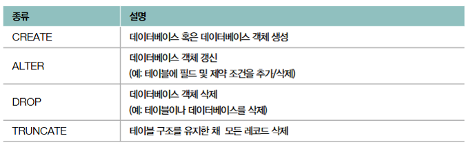
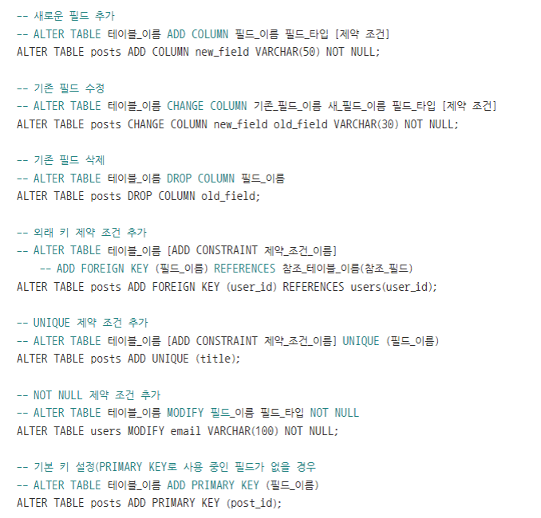
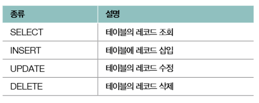
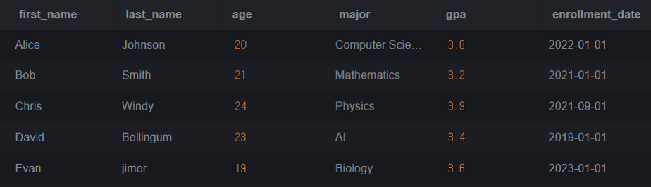
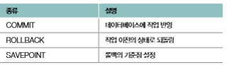

# DB 03 - SQL

SQL 명령은 크게 DDL(데이터 정의 언어), DML(데이터 조작 언어), DCL(데이터 제어 언어), TCL(트랜잭션 제어 언어) 로 나누어 진다.

## 1. DDL(Data Definition Language) - 데이터 정의 언어



### 1. CREATE
```SQL
CREATE DATABASE NAME_OF_DATABASE;
```
- CERATE 명령은 데이터베이스(CREATE DATABASE), 테이블(CREATE TABLE), 뷰(CREATE VIEW), 인덱스(CREATE INDEX), 사용자(CREATE USER)등 다양한 대상을 정의한다.
- 테이블을 생성하는 경우에는 특정 필드의 제약 조건을 명시할 수 있다.

> 예시 1) 

```SQL
CREATE TABLE users (
    user_id INT PRIMARY KEY AUTO_INCREMENT,
    username VARCHAR(50) NOT NULL,
    email VARCHAR(100) UNIQUE,
    birthday DATE,
    registration_date TIMESTAMP DEFAULT CURRENT_TIMESTAMP
);
```
> 기본 키인 user_id값은 레코드가 추가될 때마다 1식 자동 증가된다.
>
> user_name은 최대 길이가 50인 가변 길이 문자열이며 NULL값을 허용하지 않는다.
>
> email은 최대 길이 100의 고유한 값의 문자열이다.
>
> birthday는 날짜 형식이다.
>
> registration_date는 현재 시간을 기본 값으로 갖는다.

> 예시 2)

```SQL
CREATE TABLE posts (
    post_id INT AUTO_INCREMENT,
    user_id INT,
    title VARCHAR(50) NOT NULL,
    content VARCHAR(50),
    created_at TIMMESTAMP DEFAULT CURRENT_TIMESTAMP,
    PRIMARY KEY (post_id),
    CONSTRAINT FK_user_id FOREIGN KEY (user_id) REFERENCES USERS(user_id),
    CONSTRAINT UQ_title UNIQUE (title)
);
```
> 외래키를 추가하고 제약 조건을 추가한다.
>
> 기본키의 제약 조건을 추가한다.


### 2. ALTER
- ALTER 명령은 CREATE TABLE문을 통해 생성된 테이블에 새로운 필드를 추가하거나 기존의 필드를 수정/삭제할 수 있고, 제약 조건 또한 새롭게 추가, 수정, 삭제할 수 있다.



### 3. DROP
- DROP 명령은 테이블이나 데이터베이스를 삭제할 수 있다.

```SQL
DROP DATABASE {데이터베이스_이름};
DROP TABLE {테이블_이름};
```

### 4. TRUNCATE
- TRUNCATE 명령은 테이블의 구조를 유지한 채로 테이블의 모든 레코드를삭제한다.

```SQL
TRUNCATE TABLE {테이블_이름};
```

## 2. DML(Data Manupulation Langauage) - 데이터 조작 언어



### 1. INSERT
- INSERT 명령은 테이블에 레코드를 삽입한다.

- 위에서 만든 users와 posts의 테이블에 데이터를 삽입하는 예시

> 예시 1)

```SQL
INSERT INTO users (username, email, birthday) VALUES
    ('kim', 'kim@gmail.com', '1996-01-01');
    ('lee', 'lee@gmail.com', '1997-01-01');
    ('park', 'park@gmail.com', '1998-01-01');
```

> user_id와 registration_date는 자동으로 삽입된다.

> 예시 2)

```SQL
INSERT INTO posts (user_id, title, content) VALUES (1, 'Hi', 'Welcome');
```

### 2. UPDATE / DELETE
- UPDATE와 DELETE 명령은 각각 레코드를 수정 / 삭제한다.

> 예시 1)

```SQL
UPDATE users
    SET email = 'kim_updates@gmail.com'
    WHERE user_name = 'kim';
```

> 예시 2)
```SQL
DELETE FROM posts
    WHERE title = 'Hi';
```

### 3. SELECT
- SELECT 명령은 삽입된 레코드를 조회한다.

> 예시)
```SQL
CREATE TABLE students (
    id INT AUTO_INCREMENT PRIMARY KEY,
    first_name VARCHAR(50),
    last_name VARCHAR(50),
    age INT,
    major VARCHAR(50),
    gpa DECIMAL(3, 2),
    enrollment_date DATE
);

INSERT INTO students (first_name, last_name, age, major, gpa, enrollment_date) VALUES
    ('Alice', 'Johnson', 20, 'Computer Science', 3.8, '2022-01-01'),
    ('Bob', 'Smith', 21, 'Math', 3.2, '2021-01-01'),
    ('Chris', 'Windy', 24, 'Physics', 3.9, '2021-09-01'),
    ('David', 'Bellingum', 23, 'AI', 3.4, '2019-01-01'),
    ('Evan', 'jimer', 19, 'Biology', 3.6, '2023-01-01');
```
```SQL
SELECT * FROM students
```



#### GROOUP BY
특정 필드를 그룹화하기 위해 사용한다.

#### HAVING
GROUP BY절로 그룹화된 결과에 조건을 적용하기 위해 사용한다.

#### ORDER BY
특정 필드를 기준으로 데이터를 정렬하는 데 사용된다.
- ASC(오름차순)가 기본값이지만, DESC를 사용하여 내림차순으로 정렬할 수도 있다.

#### LIMIT
조회할 레코드 수를 제한하기 위해 사용한다.

#### SELECT 문법의 순서
SELECT문은 다음과 같은 순서로 실행된다.
- FROM -> WHERE -> GROUP BY -> HAVING -> SELECT -> ORDER BY -> LIMIT

## 3. TCL(Tranjaction Control Language) - 트랜잭션 제어 언어



#### 트랜잭션에는 여러 쿼리가 포함될 수 있다.

```SQL
CREATE TABLE accounts (
    account_id INT PRIMARY KEY,
    account_name VARCHAR(50),
    balance INT
);

INSERT INTO accounts (account_id, account_name, balance) VALUES (1, 'kim', 1000);
INSERT INTO accounts (account_id, account_name, balance) VALUES (2, 'lee', 500);
```

#### 두 UPDATE 문을 하나의 트랜잭션으로 구성
```SQL
UPDATE accounts SET balance = balance - 100 WHERE account_id = 1;
UPDATE accounts SET balance = balance + 100 WHERE account_id = 2;
```
```SQL
START TRANSACTION;

UPDATE accounts SET balance = balance - 100 WHERE account_id = 1;
UPDATE accounts SET balance = balance + 100 WHERE account_id = 2;
```

#### COMMIT과 ROLLBACK
1. COMMIT : 변경 내용을 적용 후 종료 -> 영구적 반영
2. ROLLBACK : 변경내용을 적용하지 않고 종료 -> 이전 상태로 되돌림

```SQL
-- ROLLBACK
START TRANSACTION;

SELECT * FROM accounts;
UPDATE accounts SET balance = balance - 100 WHERE account_id = 1;

SELECT * FROM accounts;
ROLLBACK;

SELECT * FROM accounts;
```

```SQL
-- COMMIT
START TRANSACTION;

SELECT * FROM accounts;
UPDATE accounts SET balance = balance - 100 WHERE account_id = 1;
UPDATE accounts SET balance = balance + 100 WHERE account_id =21;

SELECT * FROM accounts;
COMMIT;

SELECT * FROM accounts;
```

#### SAVEPOINT
ROLLBACK을 했을 때 되돌아갈 시점을 지정한다.
```SQL
-- 세이브 포인트 지정
SAVEPOINT {세이브포인트_이름};
-- 세이브포인트로 롤백
ROLLBACK TO SAVEPOINT {세이브포인트_이름};
```
