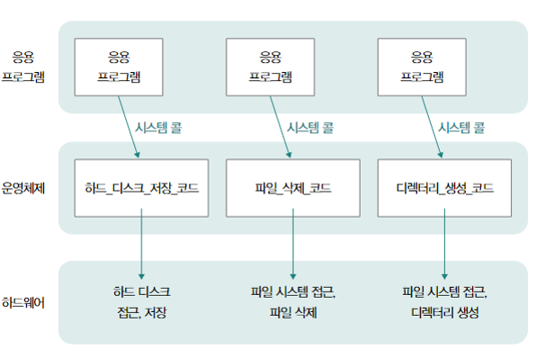

# 운영체제 01 - 운영체제의 역할 및 실행

운영체제는 2가지의 핵심 기능이 있다.

1. 자원 할당 및 관리
2. 프로세스 및 스레드 관리

## 운영체제의 역할 
### 자원이란?

    자원(Resource) : 프로그램 실행에 마땅히 필요한 요소
    데이터, 부품 등

-------------------------------------
### CPU관리 : CPU 스케줄링

    실행 중인 모든 프로그램을 공정하고 합리적으로 CPU를 할당 받도록 CPU의 할당 순서와 사용 시간을 결정하는 것

-------------------------------------
### 메모리 관리 : 가상 메모리

    실제 물리적인 메모리 크기보다 더 큰 메모리를 이용할 수 있도록 하는 기술

-------------------------------------
### 파일/디렉터리 관리 : 파일 시스템

    보조기억장치를 효율적으로 관리하기 위해 내부 정보를 파일 및 폴더 단위로 접근 및 관리할 수 있도록 만드는 내부 프로그램

-------------------------------------
### 프로세스 및 스레드 관리

    프로세스 : 실행 중인 프로그램
    스레드 : 프로세스를 이루는 실행의 단위

    동시다발적으로 실행되는 프로세스와 스레드가 올바르게 처리되도록 실행의 순서를 제어하고, 프로세스와 스레드가 요구하는 자원을 적절하게 배분한다.

## 시스템 콜과 이중 모드
###
    운영체제도 프로그램이기 때문에 프로그램 실행을 위해서는 메모리에 적재되어 있어야 한다.
    다만, 사용자의 프로그램과는 달리 '커널 영역'이라는 공간에 따로 적재되어 실행된다.
    이런 운영체제는 '시스템 콜'을 호출하여 코드를 실행한다.
    '시스템 콜'이란 운영체제의 서비스를 제공 받기 위한 수단으로 호출 가능한 함수의 형태를 가진다.
###

###
    컴퓨터 내부에서 시스템 콜이 호출되면 다음과 같은 작업이 수행된다.
    1. 소프트웨어 인터럽트 발생 : 자원에 접근하는 입출력 명령어에 의해 발생하는 인터럽트
    2. CPU의 커널 모드 전환 : 커널 영역에 적재된 코드를 실행할 때의 실행 모드
        운영체제 서비스를 제공받을 수 있음
    3. 운영체제 코드 실행
    4. 사용자 모드로 재전환 : 사용자 영역에 적재된 코드를 실행할 때의 실행 모드
        운영체제 서비스를 제공받을 수 없음

----------------------------------------------------
## 운영체제 지도

> **운영체제의 큰 그림**
> - 커널
> - 시스템 콜
> 
> ---
> 
> **프로세스 및 스레드 관리**
> - 프로세스와 스레드
> - 동기화와 교착 상태
> 
> ---
> 
> **자원 할당 및 관리**
> - **CPU 관리 : CPU 스케줄링**
>   - 우선순위
>   - 스케줄링 큐
>   - 선점형과 비선점형
>   - CPU 스케줄링 알고리즘
>   - 리눅스 CPU 스케줄링
> 
> - **메모리 관리 : 가상 메모리**
>   - 물리 주소와 논리 주소
>   - 메모리 할당
>   - 페이징과 페이지 교체 알고리즘
> 
> - **파일/디렉터리 관리 : 파일 시스템**
>   - 파일과 디렉터리
>   - 파일 시스템

