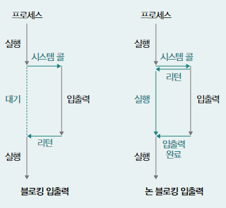
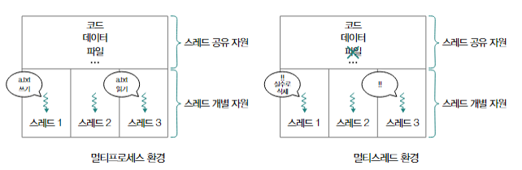
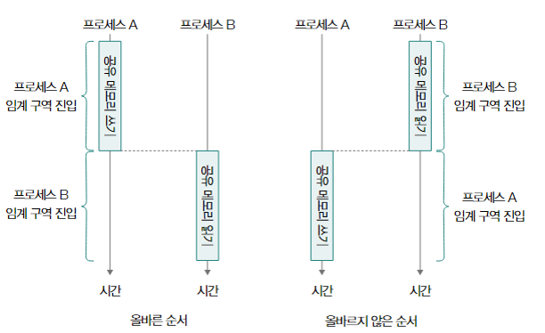
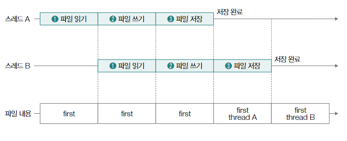
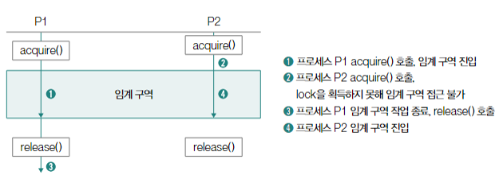
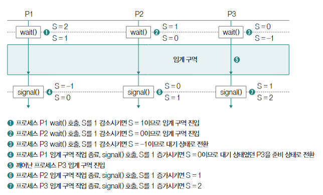

# 운영체제 02 - 프로세스와 스레드

#### 프로세스의 유형 : 포그라운드 프로세스, 백그라운드 프로세스

#### 프로세스를 구성하는 메모리 : 커널 영역, 사용자 영역(스택 영역, 힙 영역, 데이터 영역, 코드 영역)

## 1. 사용자 영역
    프로그램 실행 중 크기가 변하지 않는 정적 할당 영역 : 코드 영역, 데이터 영역
    1. 코드 영역
        실행 가능한 명령어가 저장되는 공간
        CPU가 읽고 실행할 명령어가 있는 read-only 공간
    2. 데이터 영역
        프로그램이 실행되는 동안 유지할 데이터가 저장되는 공간
        주로 정적 변수, 전역 변수가 저장된다.
####
    크기가 변할 수 있는 동적 할당 영역 : 힙 영역, 스택 영역
    1. 힙 영역
        프로그램을 만드는 사용자가 직접 할당 가능한 저장 공간
        프로그램 실행 중 자유롭게 사용 가능함.
        메모리를 사용 후에는 반환해야 하며, 이를 반환하지 않는 경우 '메모리 누수'가 발생할 수 있음.
    2. 스택 영역
        데이터 영역에 담기는 값과는 달리 일시적으로 사용할 값들이 저장되는 공간
        함수의 매개변수, 지역변수, 함수 복귀 주소 등
        스택 트레이스 형태의 함수 호출 정보가 저장될 수 있음.

## 2. 커널 영역
    1. PCB와 문맥 교환
        PCB(Process Control Block) : 프로세스 제어 블록
        프로세스와 관련한 다양한 정보를 내포하는 구조체의 일종으로, 새로운 프로세스가 메모리에 적재되었을 때, 커널 영역에 만들어지고, 프로세스의 실행이 끝나면 폐기됨
        PCB에 담기는 정보는 보통 프로세스 ID(PID), 프로세스가 사용한 레지스터 값, 프로세스의 현재 상태, CPU스케줄링의 우선순위 정보, 프로세스의 메모리 적재 위치를 알 수 있는 메모리 관련 정보, 프로세스가 사용한 파일 및 입출력장치 관련 정보 등이 있음.
        이 여러 PCB들은 커널 내부의 프로세스 테이블 형태로 관리되는 경우가 많음.
    2. 프로세스의 실행
        프로세스가 실행된다 == 운영체제에 의해 CPU의 자원을 할당받았다
        프로세스의 CPU 사용 시간은 타이머 인터럽에 의해 제한된다.
        프로세스는 자신의 차례가 되면 정해진 시간만큼 CPU를 사용하고, 타이머 인터럽트가 발생하면 자신의 차례를 양보하고 다음 차례가 올 때까지 기다린다.
        이 때, 프로세스는 지금까지의 정보를 백업한다.
        프로세스의 수행을 재개하기 위해 기억해야 할 정보를 문맥(context)라고 한다.
        이렇게 context를 백업하고 복구하여 재개하는 것을 문맥교환(context switching)이라고 한다.

## 3. 프로세스의 상태
    하나의 프로세스는 여러 상태를 거치며 실행된다.
    대표적으로 생성, 준비, 실행, 대기, 종료 등의 상태를 거치며, 운영체제는 PCB를 통해 프로세스의 상태를 인식하고 관리한다.
    1. 생성 상태(new)
        프로세스를 생성 중인 상태, 메모리에 적재되어 PCB를 할당받은 상태
    2. 준비 상태(ready)
        실행가능 상태이지만, 자신의 차례를 기다리고 있는 상태
        준비 상태인 프로세스가 CPU를 할당 받아 실행 상태로 전환되는 것을 디스패치(dispatch)라고 한다.
    3. 실행 상태(running)
        실행 상태는 CPU를 할당받아 실행 중인 상태로, 일정 시간동안 CPU를 사용한다.
        할당시간이 지나면 타이머 인터럽트가 발생하여 준비 상태가 된다. 실행 도중 입출력장치를 사용하여, 입출력장치의 작업이 끝날 때 까지 기다려야 한다면 대기 상태가 된다.
    4. 대기 상태(blocked)
        프로세스가 입출력 작업을 요청하거나 바로 확보할 수 없는 자원을 요청하는 등 곧장 실행이 불가능한 조건에 놓이는 경우에 대기 상태가 된다.
        대기 상태인 프로세스는 입출력 작업의 완료 등 실행 가능 상태가 되면 다시 준비 상태가 된다.
    5. 종료 상태(terminated)
        프로세스의 종료, 운영체제는 PCB와 프로세스가 사용한 메모리를 정리한다.

> ### 3 - 1. 블로킹 입출력과 논블로킹 입출력
> 1. 블로킹 입출력 : 입출력 작업을 수행해야 하는 상황에 대기 상태 -> 준비 상태 -> 실행 상태 가 되는 형식의 입출력 방식
> 2. 논블로킹 입출력 : 입출력장치에 입출력을 맡기고 곧바로 이어질 명령어를 실행ㅇ하는 형식의 입출력 방식
> 
> 

## 4. 멀티프로세스와 멀티스레드
    1. 멀티프로세스 : 동시에 여러 프로세스가 실행되는 것
    각기 다른 프로세스들이 기본적으로 자원을 공유하지 않고, 독립적으로 실행된다.
    같은 작업을 수행하고 있어고 각각의 PID값이 다르고, 자원이 독립적으로 할당되어 다른 프로세스에 영향을 미치지 않는다.
    따라서, 한 프로세스의 실행에 문제가 발생하더라도, 다른 프로세스에 영향을 끼치지 않는다.

    2. 멀티스레드 : 프로세스를 동시에 실행하는 여러 스레드
    하나의 스레드는 스레드 ID와 프로그램 카운터, 레지스터 값, 스택 등으로 구성된다.
    스레드 마다 각각의 프로그램 카운터 값과 스택을 가지고 있기 때문에 스레드마다 다음에 실행할 주소를 가질 수 있고, 연산 과정의 임시 저장 값을 가질 수 있다.

    3. 차이점
    멀티프로세스와 멀티스레드의 가장 큰 차이점은 '자원의 공유 여부'에 있다.
    프로세스들은 자원을 공유하지 않아 독립적으로 실행되고, 스레드들은 프로세스의 자원을 공유한다.
    스레드의 자원 공유는 혐력과 통신에 유리하지만, 한 스레드에서 생긴 문제가 프로세스 전체의 문제가 될 수 있다.

## 5. 프로세스 간 통신
    프로세스는 기본적으로 자원을 공유하지 않지만, 프로세스 간에도 자원을 공유하고 데이터를 주고 받을 수 있다.
    이를 IPC(Inter-Process Communication)이라고 부르며, 공유 메모리, 메시지 전달의 두 방식이 있다.
#### 
    1. 공유 메모리
        데이터를 주고받는 프로세스가 공통적으로 사용할 메모리 영역을 두는 방식
        프로세스는 기본적을 자원을 공유하지 않으므로 특정 프로세스가 다른 프로세스의 메모리 공간을 임의로 수정할 수 없다.
        따라서, '공유 메모리'라는 특별한 메모리 공간을 할당하여 해당 메모리 공간을 공유하여 읽고 쓴다.
        공유 메모리 기반의 IPC는 각 프로세스가 갖자의 메모리 영역을 읽고 쓰는 방식, 즉, 각 프로세스가 자신의 메모리 영역을 참조하는 것처럼 통신한다는 특징이 있다.
        따라서, 뒤의 메시지 전달보다 통신 속도가 빠른 장점이 있다.
        하지만, 각 프로세스가 서로의 공유 메모리 영역을 동시에 읽고 쓸 경우, 데이터의 일관성이 훼손될 수 있다. 이를 '레이스 컨디션'이라고 한다.
####
    2. 메시지 전달
        프로세스 간에 주고받을 데이터를 메시지의 형태로 주고받는 방식
        프로세스 간의 데이터가 커널을 거쳐 송수신된다.
        메시지의 전송과 수신이 명확하게 구분되어있다. (send(), recv()의 두 시스템 콜)
        이 방식의 IPC는 공유 메모리 기반의 IPC보다 레이스 컨디션, 동기화 등의 문제를 고려하는 일이 적지만, 통신 속도가 느리다.
        대표적인 수단으로 파이프, 시그널, 소켓, 원격 프로시저 호출(RPC)등이 있다.

## 6. 동기화와 교착 상태

    예시를 들어서 생각해보자.
####
    1. 프로세스 A가 공유 메모리 공간에 데이터를 쓰고, 프로세스 B가 해당 메모리 공간을 읽고 있는 상황이라고 가정하고,
    2. 같은 프로세스의 자원을 공유하는 스레드 간 통신이 이루어지는 상황이라고 가정해 보자.
####

    동일한 프로세스의 스레드 A와 B가 있고, 각각의 프로세스가 할당받은 파일을 수정하는 경우, 두 스레드는 파일 자원을 공유하고 있는 셈이다.

    이런 **공유자원** 은 메모리나 파일이 될 수도 있고, 전역 변수 혹은 입출력장치가 될 수도 있다.

    이 때, 공유자원을 두고 동시다발적으로 실행되는 다수의 프로세스 혹은 스레드가 마구잡이로 실행되어 공유 자원에 접근한다면 문제가 발생할 수 있다.

    이런 문제가 발생할 수 있는 코드를 **임계구역(critical section)** 이라고 한다.
####
    다음 그림의 두번째처럼, 쓰이지 않은 메모리를 읽으려 한 것은 문제가 될 수 있다.

    '프로세스 A의 공유메모리 공간에 데이터를 쓰는 코드' 와 '프로세스 B의 공유메모리 공간을 읽는 코드'는 임계 구역이 되는 것이다.

    동시에 파일을 수정하는 스레드에서도 임계 구역이 발생할 수 있다.

    다음 그림과 같은 작업이 수행된다면 스레드 A의 작업 내용이 반영되지 않을 수 있다.

    '각 스레드가 파일을 수정하는 코드'가 임계구역이 되는 것이다.

    앞선 상황들 처럼 동시에 임계구역의 코드가 실행되어 문제가 발생하는 상황을 레이스 컨디션이라고 한다.

    이렇게 레이스 컨디션이 발생한다면, 자원의 일관성을 손상시킬 수 있어서 먼저 실행된 작업이 끝날 때까지 대기해야 한다.

#### 동기화 작업
    동기화란 "실행 순서 제어" 및 "상호 배제의 원리"를 준수하며 프로세스 혹은 스레드를 실행하는 것을 의미한다.
    동기화 기법에는 뮤텍스 락, 세마포, 조건변수와 모니터, 스레드 안전 등이 있다.
####
    1. 뮤텍스 락(Mutex lock) : 동시에 접근해서는 안 되는 자원에 동시 접근이 불가능하도록 상호 배제를 보장하는 동기화 도구
        프로세스 및 스레드가 공유하는 변수(lock)와 2개의 함수(acquire, release)로 구현된다.
        '락'은 키 역할을 수행하고, acquire은 락을 획득하는 함수, release는 획득한 락을 해제하기 위한 함수이다.
        acquire을 호출하여 락을 획득했다면, release가 되기 전까지는 다른 프로세스 및 스레드가 acquire을 사용하더라고 락을 획득할 수 없다.

####
    2. 세마포(Semaphore) : 한 번에 다수의 프로세스 및 스레드까지 특정 자원을 이용할 수 있는 상황에 사용하는 동기화 도구 (뮤텍스 락은 한번에 하나의 프로세스 및 스레드만 공유 자원을 이용할 수 있는 상황)
        변수 s, wait() 함수, signal() 함수 를 이용하며, 뮤텍스 락과 사용 방식이 매우 비슷하다.

####
    3. 조건 변수와 모니터(Condition variable & Monitor) : 공유 자원과 그 공유자원을 다루는 함수로 구성된 동기화 도구로서 상호배제 및 실행 순서 제어를 모두 할 수 있는 동기화 도구
        조건 변수 : 실행 순서를 제어하기 위한 동기화 도구
            wait() : 호출한 프로세스 및 스레드의 상태를 대기 상태로 전환하는 함수
            signal() : wait()을 통해 일시 중지된 프로세스 및 스레드의 실행을 재개하는 함수
        모니터 : 프로세스 및 스레드가 공유 자원에 접근하기 위해서 반드시 정해진 공유 자원 연산을 통해 모니터로 진입하여야 하고 다른 실행중인 프로세스 및 스레드가 있다면 큐(FIFO 구조의 데이터)에서 대기해야 하는 원리
####
    4. 스레드 안전 : 멀테스레드 환경에서 어떤 변수나 함수, 객체에 동시 접근이 이루어져도 실행에 문제가 없는 상태
        레이스 컨디션이 발생했다면 스레드 안전하지 않은 상황
        스레드 안전하다면, 여러 스레드에 의해 호출되어도 레이스 컨디션이 발생하지 않는 것을 의미

### 교착 상태(deadlock)
    일어나지 않을 사건을 기다리며 프로세스의 진행이 멈춰버리는 현상
####
    자원 X, Y가 있고, 프로세스 A, B가 있다고 했을 때, 프로세스 A가 X를 점유한 채, 프로세스 B의 자원 Y를 기다리고 있고, 프로세스 B는 Y를 점유한 채 프로세스 A의 자원 X를 기다리고 있다면, 서로가 서로를 기다리다가 프로세스를 실행하지 못할 수 있다.
####
    교착 상태의 발생 조건
    1. 상호 배제 : 한 프로세스가 사용하는 자원을 다른 프로세스가 사용할 수 없는 상호 배제의 상황
    2. 점유와 대기 : 한 프로세스가 어떤 자원을 할당받은 점유 상태에서 다른 자원 할당받기를 기다리는 대기 상태인 경우
    3. 비선점 : 해당 자원을 이용하는 프로세스의 작업이 끝나야만 자원을 이용할 수 있는 경우
    4. 원형 대기 ; 프로세스와 프로세스가 요청한 자원이 원의 형태를 이루는 경우
####
    교착상태의 해결 방법
    1. 교착상태 예방
        교착 상태를 발생시키는 4가지 요건 중 하나를 충족하지 못하게 하는 방법
    2. 교착상태 회피
        교착 상태를 한정된 자원의 무분별한 할당을 발생하는 문제로 간주
        즉, 교착 상태가 발생하지 않을 정도로 조심하여 자원을 할당하는 방법
    3. 교착 상태 검출 후 회복
        프로세스를 자원 선점을 통해 회복하거나 교착 상태의 프로세스를 강제 종료 함으로써 회복하는 방법
