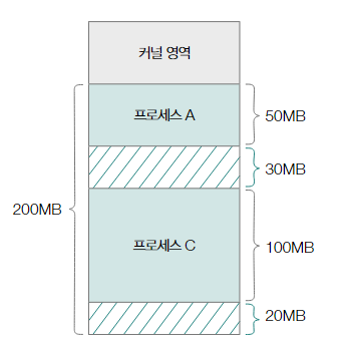
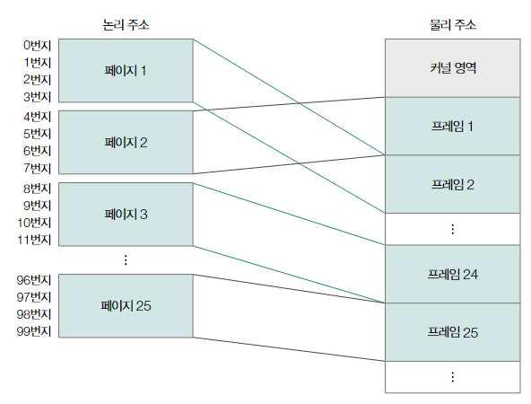
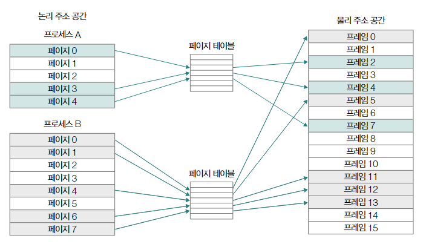
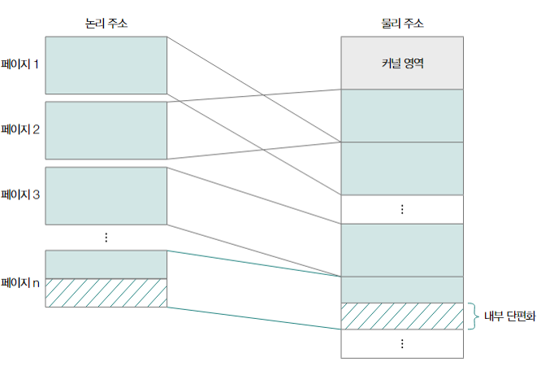
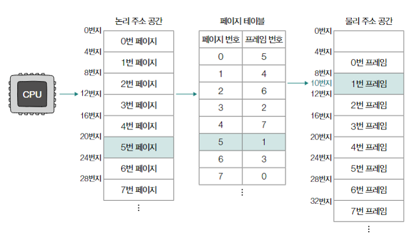

# 가상 메모리

#### 서론
CPU와 프로세스들이 메모리의 몇 번지에 무엇이 저장되어있는지 알고 있지 않다.

CPU의 저장공간이 메모리의 저장공간보다 훨씬 작기 때문이다.

## 물리 주소와 논리 주소
    물리 주소 : 메모리의 하드웨어 상 실제 주소
    논리 주소 : 프로세스마다 부여되는 0번지부터 시작하는 주소 체계
        ※ 논리 주소는 중복이 발생될 수 있음
    논리 주소는 가상의 주소이기 때문에 실제 주소인 하드웨어 상의 메모리와 상호작용하기 위해서는 반드시 논리 주소와 물리 주소간의 변환이 이루어져야 한다.
    이를 위해서 존재하는 하드웨어를 메모리 관리 장치(MMU - Memory Management Unit)가 있다.

## 스와핑과 연속 메모리 할당
### 스와핑
    메모리에 적재된 프로세스 중 실행되지 않는 프로세스가 있을 수 있다.
    이러한 프로세스들을 임시로 스왑영역(Swap Space)라는 보조기억장치의 일부로 쫓아내고, 그 빈 자리에 다른 프로세스를 적재하여 실행하는 메모리 관리방식을 스와핑이라고 한다.

스왑 아웃 : 현재 실행되지 않는 프로세스가 메모리에서 스왑 영역으로 옮겨지는 것

스왑 인 : 스왑 영역에 있는 프로세스가 다시 메모리로 옮겨오는 것

### 연속 메모리 할당, 외부 단편화
메모리 내에 프로세스들이 연속적으로 배치되는 상황에서 프로세스에 연속적인 메모리 공간을 할당하는 방식 -> 당연한 방식 처럼 보이지만 외부 단편화라는 단점이 발생한다.

외부 단편화 : 프로세스의 실행과 종료를 반복하며 메모리 사이사이에 빈 공간이 생기고, 그 빈 공간보다 큰 프로세스를 적재하기 어려운 상황이 만들어지며 메모리 낭비로 이어진다.

## 페이징을 통한 가상 메모리 관리
    스와핑과 연속 메모리 할당은 2가지의 문제가 있다.
    1) 적재와 삭제를 반복하며 빈 공간이 생기는 외부 단편화의 문제
    2) 물리 메모리보다 큰 프로세스를 실행할 수 없다는 문제
    
    이를 가상 메모리라는 기술로 해결한다.
    가상 메모리 : 실행하고자 하는 프로그램의 일부만 메모리에 적재해, 실제 메모리보다 더 큰 프로세스를 실행할 수 있도록 만드는 메모리 관리 기법

### 페이징
프로세스의 논리 주소 공간을 페이지라는 일정한 단위로 나누고, 물리 주소 공간을 페이지와 동일한 크기의 프레임이라는 일정한 단위로 나눈 뒤 페이지를 프레임에 할당하는 가상 메모리 관리 기법

이 방식은 외부 단편화가 발생하지 않는다.

    페이징 기법에서도 스와핑이 사용될 수 있다.
    페이징의 시스템에서는 프로세스 전체의 스왑 아웃/스왑 인이 되는 것이 아니라 페이지 단위로 스왑 아웃/스왑 인이 된다.
    프로세스 실행을 위해 프로세스 전체가 메모리에 적재될 필요가 없기 때문에, 실제 메모리보다 논리 메모리가 큰 경우에도 프로세스를 실행할 수 있다.

### 페이지 테이블
    물리 메모리 내에 페이지가 불연속적으로 배치되어있어 CPU 입장에서 다음으로 실행할 페이지의 위치를 찾기 어렵기 때문에 사용하는 테이블
    페이지 번호와 실제로 적재된 프레임 번호가 대응되어있다.

    테이블 엔트리 : 페이지 테이블을 구성하고 있는 각각의 행
    보통 페이지 번호, 프레임 번호, 유효 비트, 보호 비트, 참조 비트, 수정 비트 등이 포합된다.
 

    1. 유효 비트 : 해당 페이지에 접근이 가능한지 여부를 알려 주는 정보 
        페이지가 메모리, 아니면 보조기억장치에 적재되어 있는지 알려 주는 비트
        유효 비트가 0인 페이지에 접근하려고 하면 페이지 폴트라는 예외가 발생한다.
    2. 보호 비트 : 페이지 보호 기능을 위해 존재하는 비트
        읽기 r 쓰기 w 실행 x 의 조합으로 페이지의 접근 권한을 제한하며 보호한다.
    3. 참조 비트 : CPU가 해당 페이지에 접근한 적이 있는지의 여부를 나타내는 비트
    4. 수정 비트 : 해당 페이지에 데이터를 쓴 적이 있는지의 여부를 알려 주는 비트

#### 페이징의 내부 단편화 문제
    페이징은 프로세스의 논리 주소 공간을 페이지란 일정한 크기의 단위로 나누는 방식이지만, 모든 프로세스가 페이지 크기에 딱 맞게 잘리지 않을 수 있다.
    이러한 문제를 내부 단편화 라고 한다.

### 페이징 주소 체계
하나의 페이지 내에는 여러 주소가 포함되어 있기 때문에 페이징 시스템의 논리 주소는 기본적으로 <페이지 번호, 변위>의 형태로 이루어져 있다.

    페이지 번호 : 몇 번째 페이지 번호에 접근할 지 나타낸다.
    변위 : 접근하려는 주소가 페이지 시작 번지로부터 얼만큼 떨어져 있는지의 정보를 나타낸다.

## 페이지 교체 알고리즘
    요구 페이징(Demand Paging) : 메모리에 필요한 페이지만을 적재하는 기법
    
    요구 페이징의 기본적인 양상
    1. CPU가 특정 페이지에 접근하는 명령어를 실행한다.
    2. 유효 비트가 1인 경우(해당 페이지가 현재 메모리에 있는 경우) CPU는 페이지가 적재된 프레임에 접근한다.
    2-1. 유효 비트가 0인 경우(해당 페이지가 현재 메모리에 없는 경우) 페이지 폴트가 발생한다.
    3. 페이지 폴트가 발생하면 페이지 폴트 처리 루틴을 통해 해당 페이지를 메모리로 적재하고, 유효비트를 1로 설정한다. 그 이후 페이지 접근 명령을 다시 실행한다.

 

    순수 요구 페이징(Pure Demand Paging) : 아무런 페이지도 메모리에 적재하지 않은 채 무작정 프로세스를 실행하는 것

 

    페이지 교체 알고리즘 : 메모리에 적재된 페이지 중 보조기억장치로 내보낼 페이지를 선택하는 방법
    1. FIFO 교체 알고리즘
        메모리에 가장 먼저 적재된 페이지부터 스왑 아웃하는 알고리즘
        참고되고 있는 페이지를 스왑 아웃할 우려가 있다.
    2. 최적 페이지 교체 알고리즘
        앞으로 사용 빈도가 가장 낮은 페이지를 교체하는 알고리즘
        '앞으로 사용 빈도가 가장 낮은 페이지'를 예측하기가 어려워 구현이 어려움
    3. LRU(Least Recently Used) 페이지 교체 알고리즘
        가장 적게 사용한 페이지를 교체하는 알고리즘
